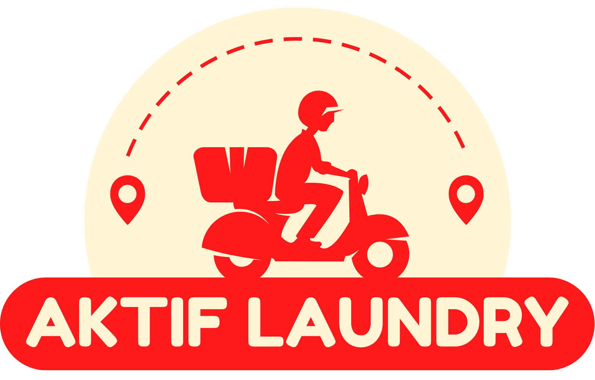

  

  # Aktif Laundry Management System

  
  
  
  

  **Sistem Manajemen Laundry Terintegrasi dengan PWA & GPS Tracking**

  Dikembangkan untuk **PT. Aktif Global Vision**

  ---

  **Tech Lead**: [Denis Djodian Ardika](https://github.com/denis156)

  
  

---

## 📖 Tentang Proyek

**Aktif Laundry** adalah sistem manajemen laundry modern yang dikembangkan khusus untuk mengoptimalkan operasional bisnis laundry **PT. Aktif Global Vision**. Sistem ini terdiri dari 3 aplikasi terintegrasi yang dirancang untuk memudahkan pengelolaan transaksi, pelacakan pesanan, dan koordinasi antara admin, pelanggan, dan kurir.

### 🎯 Tujuan Bisnis

Proyek ini dikembangkan untuk:
- ✅ **Digitalisasi Operasional**: Mengubah proses manual menjadi digital dan terotomasi
- ✅ **Meningkatkan Efisiensi**: Mempercepat proses transaksi dan pengiriman
- ✅ **Customer Experience**: Memberikan kemudahan pelanggan dalam memesan dan tracking pesanan
- ✅ **GPS Tracking**: Real-time tracking kurir dan optimasi rute pengiriman
- ✅ **Loyalty & Referral**: Sistem reward untuk meningkatkan customer retention

---

## 🏗️ Arsitektur Sistem

Sistem ini terdiri dari **3 aplikasi** yang terintegrasi:

| Aplikasi | Tipe | Platform | Pengguna |
|----------|------|----------|----------|
| **Management** | Web Dashboard | Desktop/Tablet | Admin, Kasir, Staf |
| **Customer** | Progressive Web App | Mobile (iOS/Android) | Pelanggan |
| **Courier** | Progressive Web App + GPS | Mobile (iOS/Android) | Kurir |

### 🔗 Stack Teknologi

- **Backend**: Laravel 12, PHP 8.4, Livewire 3, MySQL 8
- **Frontend**: Tailwind CSS 4, Alpine.js, Mary UI, DaisyUI
- **PWA**: Service Worker, Web App Manifest, iOS Splash Screens
- **Maps & GPS**: Leaflet.js, Geolocation API
- **Integration**: WhatsApp (Fonnte API), Google Maps/Waze

---

## 📚 Dokumentasi

Dokumentasi lengkap tersedia untuk setiap komponen sistem:

### 📱 Dokumentasi Aplikasi

1. **[Management Application](docs/apps-management.md)**
   - Dashboard admin dengan analytics & charts
   - Manajemen master data (pelanggan, kurir, staf, layanan, promo)
   - Point of Sale (POS) / Kasir
   - Sistem referral & loyalty
   - Integrasi WhatsApp
   - Non-PWA (Web-based)

2. **[Customer Application](docs/apps-pelanggan.md)**
   - Progressive Web App untuk pelanggan
   - Browse layanan & promo
   - Pemesanan online dengan maps integration
   - Tracking pesanan real-time
   - Loyalty points & referral system
   - Installable di smartphone

3. **[Courier Application](docs/apps-kurir.md)**
   - Progressive Web App untuk kurir
   - GPS tracking real-time
   - Route optimization dengan maps
   - Multi-destination delivery
   - Upload bukti delivery
   - Navigation integration (Google Maps/Waze)

### 🗄️ Dokumentasi Database

4. **[Database Schema](docs/database-diagram.md)**
   - Entity Relationship Diagram (ERD)
   - 23 tables dengan 190+ fields
   - Detail setiap tabel dan relationship
   - Business logic & indexing strategy

---

## 🌟 Fitur Unggulan

### 💼 Management Dashboard
- 📊 Real-time analytics & statistics
- 📈 Dynamic charts (line, area, bar, donut)
- 🧾 Multi-service & multi-promo transaction
- 🎁 Referral & loyalty management
- 📱 WhatsApp notification integration

### 📱 Customer PWA
- 🏠 Dashboard dengan statistik pesanan
- 🛒 Browse & order layanan laundry
- 🗺️ Set alamat pickup dengan maps
- 🎁 Promo & referral code system
- 💳 Member card & loyalty points
- 📲 Installable seperti native app

### 🚚 Courier PWA + GPS
- 📍 Real-time GPS tracking
- 🗺️ Interactive maps dengan multi-marker
- 🧭 Route optimization & navigation
- 📦 Multi-destination pickup/delivery
- 📸 Upload foto bukti delivery
- ⚡ Performance tracking & statistics

---

## 🔒 Catatan Penting

> **⚠️ PRIVATE PROJECT**: Proyek ini adalah sistem proprietary yang dikembangkan khusus untuk PT. Aktif Global Vision dan **BUKAN proyek open source**. Semua hak cipta dilindungi.

### 🚫 Tidak untuk:
- ❌ Redistribusi
- ❌ Penggunaan komersial oleh pihak lain
- ❌ Modifikasi tanpa izin
- ❌ Public contribution

### ✅ Hanya untuk:
- ✅ Penggunaan internal PT. Aktif Global Vision
- ✅ Development & maintenance oleh authorized team
- ✅ Documentation & reference purposes

---

## 👥 Tim Development

**Tech Lead**: Denis Djodian Ardika
**Company**: PT. Aktif Global Vision
**Repository**: Private (Internal Use Only)

---

## 📄 License

**Proprietary Software** - © 2025 PT. Aktif Global Vision. All Rights Reserved.

Sistem ini dilindungi oleh hak cipta dan merupakan properti eksklusif PT. Aktif Global Vision. Penggunaan, modifikasi, atau distribusi tanpa izin tertulis dilarang keras.

---

  **Aktif Laundry Management System** © 2025

  Dikembangkan dengan ❤️ untuk PT. Aktif Global Vision

  

