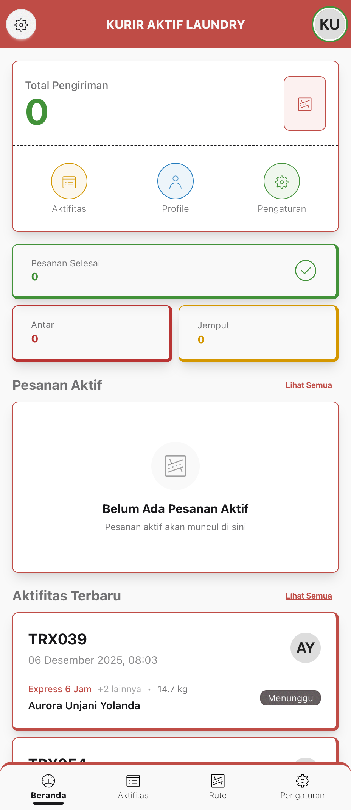
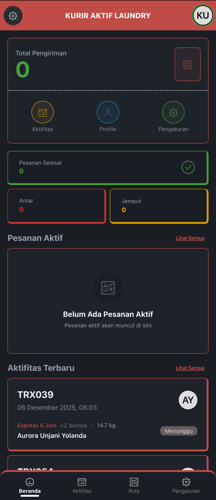
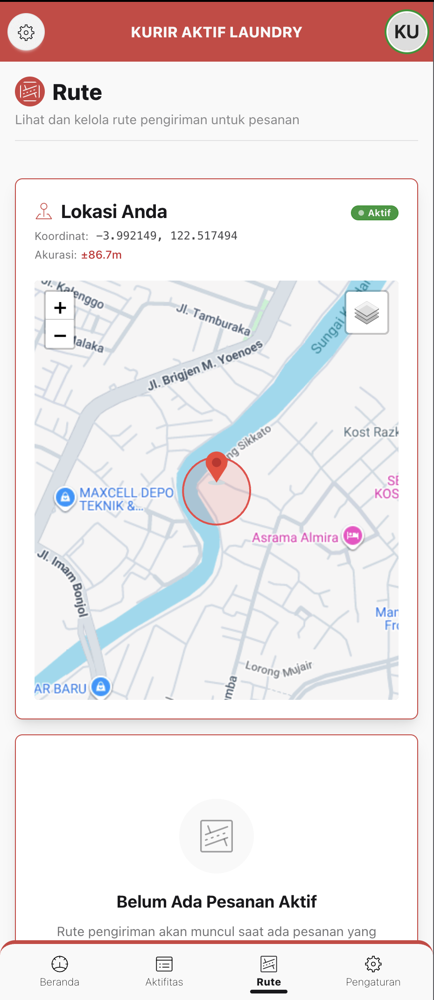

<div align="center">
  

  # SiAktif - Courier Application

  [](https://laravel.com)
  [](https://livewire.laravel.com)
  [](https://web.dev/progressive-web-apps/)
  [](https://leafletjs.com)
  [](https://tailwindcss.com)

  **Progressive Web App untuk Kurir Laundry dengan GPS Tracking**

  Dibuat oleh [Denis Djodian Ardika](https://github.com/denis156) - Tech Lead at PT. Aktif Global Vision

  [](https://github.com/denis156/aktif-laundry)
</div>

---

## 📋 Daftar Isi

- [Tentang Aplikasi](#-tentang-aplikasi)
- [Fitur Utama](#-fitur-utama)
- [Halaman & Modul](#-halaman--modul)
- [Komponen](#-komponen)
- [GPS & Maps Features](#-gps--maps-features)
- [PWA Features](#-pwa-features)
- [Teknologi](#-teknologi)

---

## 📱 Tentang Aplikasi

Aplikasi Courier adalah **Progressive Web App (PWA)** yang dirancang khusus untuk kurir laundry dalam mengelola pengiriman dan penjemputan. Dilengkapi dengan **GPS tracking real-time**, **route optimization**, dan **maps integration** menggunakan Leaflet.js untuk memudahkan navigasi ke lokasi customer.

> **PWA + GPS Enabled**: Aplikasi dapat diinstall di smartphone dan menggunakan GPS untuk tracking lokasi real-time serta menampilkan rute pengiriman di peta interaktif.

### 📸 Screenshots

<div align="center">

#### 🌞 Light Mode


#### 🌙 Dark Mode


#### 🗺️ Route & Maps

*Halaman Rute dengan peta menampilkan lokasi kurir dan titik-titik pesanan yang akan diantar*

</div>

---

## ✨ Fitur Utama

### 🏠 Beranda & Dashboard


- **Total Pengiriman**: Statistik total pengiriman kurir
- **Pesanan Selesai**: Jumlah pesanan yang sudah diselesaikan
- **Antar & Jemput**: Split metrics untuk delivery & pickup
- **Quick Access**: Shortcut ke Rute, Aktifitas, Profile, Pengaturan
- **Pesanan Aktif**: List pesanan yang sedang dikerjakan
- **Auto Refresh**: Real-time update setiap 10 detik

### 🗺️ Rute & Navigation


- **Interactive Maps**: Peta dengan marker lokasi kurir dan customer
- **Real-time GPS**: Tracking lokasi kurir secara real-time
- **Route List**: Daftar pesanan aktif dengan alamat lengkap
- **Distance Calculation**: Perhitungan jarak dari lokasi kurir ke customer
- **Map Markers**: Pin untuk setiap lokasi pengiriman/penjemputan
- **My Location**: Tombol untuk center map ke lokasi kurir
- **Multi-Destination**: Tampilan multiple markers untuk banyak pesanan
- **Route Detail**: Detail lengkap pesanan dengan navigasi ke maps

### 📦 Detail Rute


- **Customer Info**: Nama, alamat, nomor HP pelanggan
- **Order Summary**: Detail layanan, berat/jumlah, total bayar
- **Pickup/Delivery Type**: Indikator jemput atau antar
- **Navigation Button**: Buka Google Maps/Waze untuk navigasi
- **Status Update**: Update status pesanan (Dalam Perjalanan, Selesai)
- **Upload Bukti**: Upload foto bukti delivery
- **Timeline**: Timeline pengiriman (jadwal, mulai, selesai)
- **Contact Customer**: Tombol untuk hubungi customer via WA/Telp

### 📋 Aktifitas


- **History Pengiriman**: Riwayat semua pengiriman kurir
- **Filter by Status**: Filter berdasarkan status pengiriman
- **Filter by Type**: Filter jemput atau antar
- **Search**: Cari berdasarkan kode transaksi atau nama customer
- **Detail Aktifitas**: Lihat detail setiap pengiriman
- **Earnings Tracking**: Track pendapatan dari pengiriman
- **Performance Stats**: Statistik performa kurir

### 👤 Profile & Pengaturan


- **Profile Management**: Update profil, foto, dan data diri
- **Vehicle Info**: Data kendaraan (no polisi, jenis)
- **Bank Account**: Informasi rekening untuk gaji/bonus
- **Emergency Contact**: Kontak darurat untuk keamanan
- **Change Password**: Ubah password akun
- **App Settings**: Pengaturan notifikasi dan GPS
- **Logout**: Keluar dari akun

### 🔐 Authentication


- **Login**: Masuk dengan email/no HP dan password
- **Forgot Password**: Reset password via email
- **Email Verification**: Verifikasi email (optional)
- **Remember Me**: Login otomatis
- **Secure Session**: Session management untuk keamanan

---

## 🗂️ Halaman & Modul

### Authentication
```
📁 /kurir/auth/
  ├── 🔐 login                    # Login page
  ├── 🔑 forgot-password          # Forgot password page
  ├── 🔄 reset-password           # Reset password page
  └── ✉️ verify-email             # Email verification page
```

### Main Application
```
📁 /kurir/
  ├── 🏠 beranda                  # Dashboard dengan statistik pengiriman
  ├── 🗺️ rute                     # Maps dengan list pesanan aktif (GPS tracking)
  ├── 📋 aktifitas                # Riwayat semua pengiriman
  ├── 👤 profile                  # Profile management
  └── ⚙️ pengaturan               # App settings
```

### Route Module
```
📁 /kurir/rute/
  ├── 📍 rute                     # Main route page dengan maps & list
  └── 🧭 rute-detail/{id}         # Detail rute untuk navigasi & update status
```

### Activity Module
```
📁 /kurir/aktifitas/
  ├── 📋 aktifitas                # List semua aktifitas pengiriman
  └── 👁️ detail-aktifitas/{id}    # Detail pengiriman history
```

---

## 🧩 Komponen

Aplikasi Kurir dilengkapi dengan komponen-komponen khusus untuk delivery operations:

### Navigation Components
| Komponen | Deskripsi | Lokasi |
|----------|-----------|--------|
| **Top Nav** | Header navigasi dengan logo dan kurir info | `kurir/component/top-nav` |
| **Bottom Nav** | Bottom navigation bar untuk menu utama | `kurir/component/bottom-nav` |

### Maps Components
| Komponen | Deskripsi | Lokasi |
|----------|-----------|--------|
| **Lokasi Saya** | Interactive map dengan GPS tracking dan markers | `kurir/component/lokasi-saya` |

---

## 🗺️ GPS & Maps Features

### Real-time GPS Tracking


#### Location Features
- 📍 **Current Location**: Track lokasi kurir real-time
- 🎯 **Auto Center**: Auto-center peta ke lokasi kurir
- 📌 **Customer Markers**: Pin untuk setiap lokasi customer
- 🔄 **Live Updates**: GPS position update otomatis
- 📏 **Distance Calculation**: Hitung jarak ke setiap lokasi
- 🧭 **Compass Direction**: Arah ke lokasi customer

#### Map Interaction
- 🗺️ **Leaflet.js Maps**: Interactive maps dengan OpenStreetMap
- 🖱️ **Touch Gestures**: Pinch to zoom, drag to pan
- 📱 **Mobile Optimized**: Touch-friendly controls
- 🎨 **Custom Markers**: Icon berbeda untuk jemput/antar
- 🔍 **Zoom Controls**: Zoom in/out untuk detail area
- 📍 **My Location Button**: Quick center ke lokasi kurir

#### Navigation Integration
- 🚗 **Google Maps**: Buka di Google Maps untuk turn-by-turn navigation
- 🗺️ **Waze Integration**: Opsi navigasi via Waze
- 🧭 **Route Planning**: Optimize route untuk multiple destinations
- 📱 **Deep Links**: Direct link ke aplikasi maps

### Location Tracking
- ✅ **Continuous Tracking**: GPS tracking selama delivery
- 💾 **Track History**: Simpan tracking history untuk audit
- 📊 **Distance Traveled**: Total jarak tempuh
- ⏱️ **Time Tracking**: Waktu mulai dan selesai delivery
- 🔋 **Battery Optimized**: Efficient GPS usage untuk hemat baterai

---

## 📱 PWA Features

### Progressive Web App Capabilities


#### Installation
- ✅ **Add to Home Screen**: Install seperti native app
- ✅ **App Icons**: Icon untuk berbagai ukuran device
- ✅ **Splash Screens**: iOS splash screens untuk semua device
- ✅ **Standalone Mode**: Buka tanpa browser UI

#### iOS Support
- 📱 **iPhone SE, 6, 7, 8**: 640x1136, 750x1294
- 📱 **iPhone 6+, 7+, 8+**: 1242x2148
- 📱 **iPhone X, XS, 11 Pro**: 1125x2436
- 📱 **iPhone XR, 11**: 414x816
- 📱 **iPad 7, 8, 9**: 1536x2048
- 📱 **iPad Pro 10.5**: 1668x2224
- 📱 **iPad Pro 12.9**: 2048x2732

#### Performance
- ⚡ **Fast Loading**: Optimized asset loading
- 🔄 **Auto Refresh**: Real-time data dengan wire:poll
- 📡 **Offline Ready**: Service worker untuk offline access
- 💾 **Cache Strategy**: Smart caching untuk maps tiles
- 🔋 **Battery Efficient**: Optimized untuk penggunaan battery

#### Mobile Optimization
- 📱 **Touch Optimized**: Large touch targets
- 🎨 **Responsive Design**: Adaptive layout
- 🌈 **Theme Color**: Custom theme color
- 📍 **Background Geolocation**: GPS tracking di background
- 🔔 **Push Notifications**: Notifikasi pesanan baru

---

## 🛠️ Teknologi

<div align="center">

### Backend


### Frontend


### Maps & GPS


### Tools


</div>

---

## 🎨 UI/UX Features

### Mobile-First Design


### Theme Support


### User Experience
- ⚡ **SPA Experience**: No page reload dengan Livewire
- 🔄 **Real-time Updates**: Auto-refresh pesanan aktif
- ✨ **Smooth Animations**: Transisi smooth dan natural
- 👆 **Touch Gestures**: Swipe, tap optimized untuk maps
- 🚀 **Quick Actions**: FAB untuk akses rute cepat
- 💬 **Toast Notifications**: Feedback untuk setiap aksi
- 📍 **Full Screen Maps**: Peta full screen dengan controls
- 🎯 **Bottom Navigation**: Easy thumb reach
- 📞 **Quick Contact**: Tombol cepat hubungi customer
- 🧭 **Navigation Shortcuts**: Quick open Google Maps/Waze

---

## 🚚 Courier Journey

### 1️⃣ Login & Start Day
```
Login → Lihat Dashboard → Check Pesanan Aktif di Rute
```

### 2️⃣ Pickup Flow
```
Buka Rute → Lihat Maps & Marker Customer → Pilih Pesanan Jemput →
Klik Navigasi → Perjalanan ke Lokasi → Update Status "Dalam Perjalanan" →
Sampai Lokasi → Jemput Cucian → Upload Foto Bukti → Update "Selesai"
```

### 3️⃣ Delivery Flow
```
Buka Rute → Lihat Maps & Marker Customer → Pilih Pesanan Antar →
Klik Navigasi → Perjalanan ke Lokasi → Update Status "Dalam Perjalanan" →
Sampai Lokasi → Antar Cucian → Upload Foto Bukti → Update "Selesai"
```

### 4️⃣ End of Day
```
Lihat Aktifitas → Review Semua Pengiriman Hari Ini → Check Statistik
```

---

## 📊 Courier Features

### Dashboard Metrics
- 📦 **Total Pengiriman**: Total semua pengiriman kurir
- ✅ **Pesanan Selesai**: Pesanan yang sudah diselesaikan
- 🚚 **Total Antar**: Jumlah delivery
- 📥 **Total Jemput**: Jumlah pickup
- 📈 **Performance Stats**: Statistik performa harian/bulanan

### Route Optimization
- 🗺️ **Visual Route**: Lihat semua lokasi di peta
- 📏 **Distance Info**: Jarak dari lokasi kurir ke customer
- 🎯 **Nearest First**: Urutkan pesanan berdasarkan jarak terdekat
- 🔄 **Dynamic Updates**: Update route saat ada pesanan baru
- 📍 **Multi-Stop**: Handle multiple pickup/delivery dalam satu trip

### Status Management
- 🟡 **Dijadwalkan**: Pesanan yang dijadwalkan untuk hari ini
- 🔵 **Dalam Perjalanan**: Status saat kurir sedang on the way
- 🟢 **Selesai**: Pesanan yang sudah diselesaikan
- 🔴 **Batal**: Pesanan yang dibatalkan

### Evidence Upload
- 📸 **Photo Upload**: Upload foto bukti delivery
- 💾 **Auto Save**: Simpan otomatis ke server
- 🖼️ **Image Preview**: Preview sebelum upload
- 📱 **Camera Access**: Akses kamera langsung dari app

---

## 🔔 Notifications

### Real-time Alerts
- 📬 **New Assignment**: Notifikasi pesanan baru assigned
- 📍 **Nearby Delivery**: Alert saat mendekati lokasi customer
- ✅ **Status Update**: Konfirmasi setiap status update
- 💰 **Payment Received**: Notifikasi pembayaran dari customer
- ⏰ **Schedule Reminder**: Reminder jadwal pickup/delivery

---

## 🔐 Security Features

- 🔒 **Authentication**: Laravel Sanctum untuk session management
- 🛡️ **Courier Verification**: Hanya kurir terverifikasi yang bisa akses
- ✅ **CSRF Protection**: Built-in Laravel CSRF protection
- 🔑 **Password Hashing**: Bcrypt password hashing
- 📧 **Email Verification**: Optional email verification
- 📝 **Activity Logging**: Audit trail untuk semua aktifitas
- 🚫 **Session Timeout**: Auto logout untuk keamanan
- 📍 **Location Privacy**: GPS data hanya untuk operational purposes

---

## 📱 Maps Integration Deep Dive

### Leaflet.js Implementation
```javascript
// Features Implemented:
✅ Real-time GPS tracking
✅ Multiple custom markers (kurir & customers)
✅ Auto-center to current location
✅ Polyline untuk route visualization
✅ Popup info untuk setiap marker
✅ Distance calculation
✅ Touch-optimized controls
✅ Responsive map tiles
```

### Marker Types
- 🔴 **Kurir Marker**: Real-time location kurir (red marker)
- 🟢 **Pickup Marker**: Lokasi jemput cucian (green marker)
- 🔵 **Delivery Marker**: Lokasi antar cucian (blue marker)
- ⚪ **Completed Marker**: Pesanan selesai (gray marker)

### Map Controls
- 🎯 **My Location**: Center map ke GPS kurir
- ➕ **Zoom In/Out**: Control zoom level
- 📏 **Scale**: Tampilan skala jarak
- 🧭 **Attribution**: Map data attribution

---

## 💼 Courier Management

### Performance Tracking
- 📊 **Daily Stats**: Statistik harian pengiriman
- 📈 **Weekly/Monthly Reports**: Laporan performa bulanan
- ⭐ **Rating**: Customer rating untuk kurir
- 💰 **Earnings**: Track pendapatan dari delivery fee
- 🏆 **Achievements**: Badge untuk milestone tertentu

### Emergency Features
- 🆘 **Emergency Contact**: Quick dial kontak darurat
- 📞 **Support Hotline**: Hubungi support jika ada masalah
- ⚠️ **Report Issue**: Laporkan kendala pengiriman
- 🚨 **SOS Button**: (Future) Emergency panic button

---

## 📞 Kontak & Support

**Developer**: Denis Djodian Ardika
**Position**: Tech Lead
**Company**: PT. Aktif Global Vision
**Repository**: [github.com/denis156/aktif-laundry](https://github.com/denis156/aktif-laundry)

---

<div align="center">

  **SiAktif Courier App** © 2025 - PT. Aktif Global Vision

  [](https://github.com/denis156/aktif-laundry)
  [](https://github.com/denis156/aktif-laundry)
  [](https://github.com/denis156/aktif-laundry)

</div>
