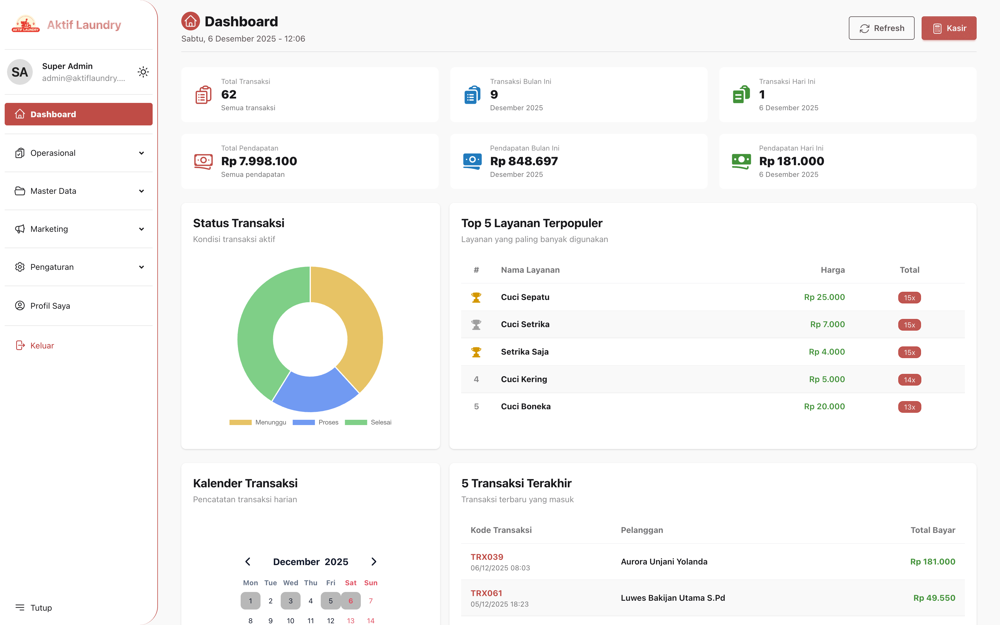
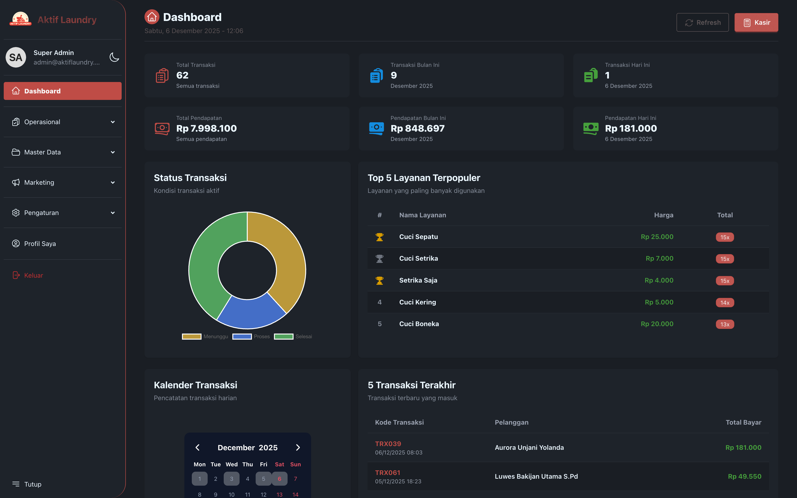

<div align="center">
  

  # Aktif Laundry - Management Application

  [](https://laravel.com)
  [](https://livewire.laravel.com)
  [](https://php.net)
  [](https://tailwindcss.com)
  [](https://mary-ui.com)

  **Admin Dashboard untuk Pengelolaan Laundry**

  Dibuat oleh [Denis Djodian Ardika](https://github.com/denis156) - Tech Lead at PT. Aktif Gapura Internasional

  [](https://github.com/denis156/aktif-laundry)
</div>

---

## 📋 Daftar Isi

- [Tentang Aplikasi](#-tentang-aplikasi)
- [Fitur Utama](#-fitur-utama)
- [Halaman & Modul](#-halaman--modul)
- [Komponen](#-komponen)
- [Teknologi](#-teknologi)

---

## 📱 Tentang Aplikasi

Aplikasi Management adalah **dashboard admin** berbasis web untuk mengelola seluruh operasional laundry. Aplikasi ini dibangun dengan **Laravel 12**, **Livewire 3**, dan **Mary UI** untuk memberikan pengalaman pengguna yang cepat dan responsif tanpa perlu reload halaman. Dilengkapi dengan **real-time courier tracking**, **chat system**, **interactive charts**, dan **Mapbox integration**.

> **Catatan**: Aplikasi Management **tidak menggunakan PWA**, berbeda dengan aplikasi Kurir dan Pelanggan yang merupakan Progressive Web Apps.

### ✨ What's New in This Documentation
- 🔔 **Firebase Push Notifications**: Send real-time notifications ke Kurir & Pelanggan dengan FCM
- 💬 **Chat System**: Dokumentasi lengkap chat dengan kurir, pelanggan, dan staf
- 📍 **Real-time Tracking**: Live tracking semua kurir aktif dengan GPS metrics
- 🗺️ **MapPicker Integration**: Mapbox Search Box API untuk location selection
- 📊 **Dashboard Analytics**: Detailed chart configuration dan statistics
- 🎨 **Chart.js Integration**: Line, Bar, Area, dan Donut charts
- 🔍 **Advanced Filters**: Filter conversations by type, search locations
- 🚀 **Performance Features**: Cache-based tracking, optimized queries

### 📸 Screenshots

<div align="center">

#### 🌞 Light Mode


#### 🌙 Dark Mode


</div>

---

## ✨ Fitur Utama

### 🎯 Dashboard & Analytics
- **Statistik Real-time**: Total transaksi, pendapatan (hari ini, bulan ini, dan keseluruhan)
- **Grafik Dinamis**: Line chart, area chart, dan bar chart untuk visualisasi data transaksi
- **Top 5 Layanan**: Menampilkan layanan paling populer dengan ranking
- **Status Transaksi**: Donut chart untuk melihat distribusi status transaksi
- **Kalender Transaksi**: Event calendar untuk tracking transaksi harian
- **5 Transaksi Terakhir**: Monitoring transaksi terbaru yang masuk
- **Filter Periode**: Harian, mingguan, bulanan, dan tahunan

### 💼 Manajemen Master Data


- **Pelanggan**: CRUD pelanggan, loyalty points, member card, referral tracking
- **Kurir**: CRUD kurir, data kendaraan, bank account, emergency contact
- **Staf**: CRUD staf/kasir, jam kerja, gaji, data bank untuk penggajian
- **Jenis Pakaian**: CRUD jenis pakaian dengan icon picker
- **Layanan**: CRUD layanan, pricing (per kg/satuan), durasi, min/max order
- **Promo**: CRUD promo dengan multiple tipe diskon, targeting, dan auto-apply

### 🧾 Transaksi & Kasir


- **Kasir POS**: Point of Sale untuk transaksi cepat dengan kalkulator
- **Multi-Layanan**: Satu transaksi bisa memiliki banyak layanan
- **Multi-Promo**: Apply multiple promo dengan urutan prioritas
- **Payment Tracking**: Metode pembayaran, tipe bayar, status verifikasi
- **Bukti Digital**: Upload foto timbangan dan bukti pembayaran
- **Receipt/Struk**: Generate receipt untuk customer
- **WhatsApp Integration**: Kirim notifikasi via WhatsApp

### 🎁 Referral & Loyalty


- **Kode Referral**: Generate kode referral unik per pelanggan
- **Dual Promo**: Promo berbeda untuk referee dan referrer
- **Campaign Tracking**: Track performa per campaign source
- **Statistics**: Total referral dan conversion rate

### 📱 Messaging (Fonnte Integration)


- **Send Messages**: Kirim pesan WhatsApp ke pelanggan/kurir
- **Media Support**: Kirim file, gambar, dan lokasi
- **Scheduling**: Jadwalkan pengiriman pesan
- **Typing Simulation**: Simulasi typing untuk natural conversation

### 💬 Chat & Communication


- **Multi-participant Chat**: Chat dengan Kurir, Pelanggan, dan Staf
- **Real-time Messaging**: Chat system dengan Livewire polling
- **File Sharing**: Upload dan kirim file (images, PDF, DOC) max 5MB
- **Conversation Management**: Create, delete conversation
- **Search & Filter**: Search by name/message, filter by type (Kurir/Pelanggan/Staf)
- **Unread Counter**: Badge untuk unread messages
- **Message History**: Last 50 messages per conversation
- **Auto-delete Files**: Cascade file deletion when conversation deleted

### 📍 Real-time Tracking


- **Live Courier Tracking**: Track semua kurir aktif real-time di map
- **Multiple Markers**: Lihat semua kurir aktif sekaligus di satu peta
- **Courier Selection**: Pilih kurir tertentu untuk zoom dan detail view
- **GPS Metrics**: Speed, bearing, accuracy, dan coordinates
- **Customer Destination**: Lihat tujuan delivery kurir (nama & alamat pelanggan)
- **Active Status**: Hanya tampilkan kurir yang aktif (updated < 2 menit)
- **Auto Refresh**: Update tracking data setiap periode
- **Detail View**: Halaman detail tracking per kurir dengan route info

### ⚙️ Pengaturan Sistem


- **Konfigurasi Global**: Key-value pairs dengan grouping
- **Type Support**: String, number, boolean, dan JSON
- **Referral Settings**: Pengaturan khusus untuk sistem referral
- **Super Admin Only**: Hanya super admin yang bisa akses pengaturan

### 👤 Profile & Authentication


- **Login/Logout**: Autentikasi admin/kasir/staf
- **Forgot Password**: Reset password via email
- **Email Verification**: Verifikasi email pengguna
- **Profile Management**: Update profil, avatar, dan password
- **Role-based Access**: Super Admin, Kasir, Staf dengan permission berbeda

---

## 🗂️ Halaman & Modul

### Authentication
```
📁 /management/auth/
  ├── 🔐 login                    # Login page
  ├── 🔑 forgot-password          # Forgot password page
  ├── 🔄 reset-password           # Reset password page
  └── ✉️ verify-email             # Email verification page
```

### Main Application
```
📁 /management/
  ├── 🏠 dashboard                # Dashboard dengan analytics & charts
  ├── 🧮 kasir                    # Point of Sale / Kasir
  ├── 💬 chat                     # Chat dengan kurir, pelanggan, dan staf
  ├── 📍 tracking                 # Real-time tracking kurir aktif
  ├── 👤 profile                  # User profile management
  └── ⚙️ pengaturan               # Global settings (Super Admin only)
```

### Master Data Modules
```
📁 /management/pelanggan/
  ├── 📋 index                    # List pelanggan dengan search & filter
  ├── ➕ create                   # Form tambah pelanggan baru
  └── ✏️ edit/{id}                # Form edit pelanggan

📁 /management/kurir/
  ├── 📋 index                    # List kurir dengan status tracking
  ├── ➕ create                   # Form tambah kurir baru
  └── ✏️ edit/{id}                # Form edit kurir

📁 /management/staf/
  ├── 📋 index                    # List staf/kasir
  ├── ➕ create                   # Form tambah staf baru
  └── ✏️ edit/{id}                # Form edit staf

📁 /management/jenis-pakaian/
  ├── 📋 index                    # List jenis pakaian
  ├── ➕ create                   # Form tambah jenis pakaian
  └── ✏️ edit/{id}                # Form edit jenis pakaian

📁 /management/layanan/
  ├── 📋 index                    # List layanan dengan pricing
  ├── ➕ create                   # Form tambah layanan baru
  └── ✏️ edit/{id}                # Form edit layanan

📁 /management/promo/
  ├── 📋 index                    # List promo dengan status & kuota
  ├── ➕ create                   # Form tambah promo baru
  └── ✏️ edit/{id}                # Form edit promo
```

### Transaction Module
```
📁 /management/transaksi/
  ├── 📋 index                    # List transaksi dengan filter
  ├── ➕ create                   # Form transaksi baru (multi-layanan)
  └── ✏️ edit/{id}                # Form edit transaksi
```

### Referral Module
```
📁 /management/referral/
  ├── 📋 index                    # List referral codes dengan statistics
  ├── ✏️ edit/{id}                # Edit referral settings
  └── ⚙️ pengaturan               # Pengaturan sistem referral
```

### Messaging Module (Fonnte)
```
📁 /management/fonnte/
  ├── 📋 index                    # List message history
  ├── ➕ create                   # Send new message
  └── ✏️ edit/{id}                # Edit scheduled message
```

### Chat Module
```
📁 /management/chat/
  ├── 💬 chat                     # List semua percakapan dengan filter
  └── 💭 chat-room/{conversation} # Chat room untuk percakapan tertentu
```

### Tracking Module
```
📁 /management/tracking/
  ├── 📍 tracking                 # Map view semua kurir aktif
  └── 🗺️ tracking/{id}            # Detail tracking per kurir dengan route info
```

---

## 🧩 Komponen

Aplikasi Management dilengkapi dengan komponen-komponen custom yang dapat digunakan kembali:

### UI Components
| Komponen | Deskripsi | Fitur | Lokasi |
|----------|-----------|-------|--------|
| **Icon Picker** | Pilih icon dari iconpark | Search icon, preview icon, 300+ icons | `management/components/icon-picker` |
| **String List Input** | Input array of strings | Add/remove items, validation | `management/components/string-list-input` |
| **Key Value Jenis Pakaian** | Input jenis pakaian dengan jumlah | Select pakaian, input jumlah | `management/components/key-value-jenis-pakaian` |
| **Multi Layanan Form** | Form multiple layanan dalam transaksi | Add/remove layanan, auto calculate | `management/components/multi-layanan-form` |
| **Receipt** | Generate receipt/struk transaksi | Print-friendly, QR code, detail lengkap | `management/components/receipt` |
| **WhatsApp Button** | Quick action button kirim WhatsApp | Auto-format message, open WhatsApp | `management/components/whats-app-button` |
| **Map Picker** | Interactive map untuk pilih lokasi | Mapbox search, drag marker, coordinates | `management/components/map-picker` |

---

## 🛠️ Teknologi

<div align="center">

### Backend


### Frontend


### Integration & APIs


### Maps & GPS


### Tools


</div>

### Key Technologies Breakdown

#### Laravel 12 Features Used
- 🔐 **Authentication**: Default web guard untuk admin/staf
- ✅ **Email Verification**: Optional verification dengan middleware
- 📁 **File Storage**: Public disk untuk avatars dan chat attachments
- 💾 **Cache System**: Cache untuk courier tracking data
- 🗄️ **Eloquent ORM**: Complex relationships dan query builder
- 🔄 **Observers**: Auto cleanup files on conversation delete
- 🎭 **Middleware**: Role-based access (`super_admin` middleware)
- 🌐 **Localization**: Carbon locale Indonesia untuk dates

#### Livewire 3 Features Used
- 🔄 **Wire:navigate**: SPA-like navigation tanpa reload
- 📊 **Computed Properties**: Cached data properties
- 🎯 **Wire:poll**: Auto-refresh tracking data dan chat
- 📡 **Event Dispatch**: JavaScript events untuk map updates
- 📁 **File Uploads**: WithFileUploads trait untuk chat files
- 💬 **Toast**: Mary UI toast untuk user feedback
- 🔔 **Listeners**: Event listeners untuk real-time updates
- 🎨 **Wire:loading**: Loading states untuk semua actions

#### Chart.js Features
- 📈 **Line Charts**: Trend visualization dengan dual Y-axis
- 📊 **Bar Charts**: Comparative data display
- 📉 **Area Charts**: Filled line charts dengan gradients
- 🍩 **Donut Charts**: Status distribution dengan custom colors
- 🎨 **Responsive**: Auto-resize dengan aspect ratio
- 🔄 **Dynamic Data**: Real-time chart updates
- 📱 **Mobile Optimized**: Touch-friendly legends dan tooltips

#### Mapbox Integration
- 🔍 **Search Box API**: Location autocomplete search
- 📍 **Retrieve API**: Get coordinates dari location ID
- 🌐 **Indonesian Support**: Language dan country filtering
- 🎯 **Proximity Bias**: Prioritize nearest results
- 💾 **Session Tokens**: API rate limit optimization
- ⚡ **10s Timeout**: Reliable HTTP requests

#### Firebase Push Notifications
- 🔥 **Firebase Cloud Messaging**: Server-side push notification sending
- 📤 **FirebaseService**: Laravel service untuk FCM integration
- 🔐 **Token Management**: Store & validate FCM tokens (users, kurir, pelanggan)
- 📊 **Delivery Tracking**: Monitor notification delivery & open rates
- 🎯 **Targeted Notifications**: Send to specific users atau broadcast
- 📝 **Audit Logging**: Track all notifications sent
- 🚫 **Rate Limiting**: Prevent notification spam
- ⚡ **Laravel HTTP Client**: Modern HTTP client untuk FCM API

---

## 💬 Chat System Deep Dive

### Real-time Messaging Features
```javascript
// Chat Capabilities untuk Management:
✅ Multi-participant: Chat dengan Kurir, Pelanggan, dan Staf lainnya
✅ File upload: images (jpg, jpeg, png, gif), documents (pdf, doc, docx)
✅ Max file size: 5MB per file
✅ Message validation: max 5000 characters
✅ Auto-scroll to new messages dengan event dispatch
✅ Unread message counter per conversation
✅ Mark messages as read automatically
✅ Image preview modal sebelum kirim
✅ Full-screen image viewer untuk received images
✅ Delete conversation dengan cascade file deletion
✅ Search conversations by name atau message content
✅ Filter by participant type: Kurir, Pelanggan, Staf
✅ Last message preview in conversation list
✅ Avatar support untuk semua participant
✅ Drawer navigation untuk mobile
```

### Chat Storage & Performance
- 📁 **File Storage**: Chat attachments di `storage/app/public/chat-attachments/`
- 💾 **Auto Cleanup**: Files deleted saat conversation deleted (via Observer)
- 🔄 **Message Limit**: Load last 50 messages per conversation
- 📊 **Efficient Queries**: ChatHelper dengan optimized queries
- 🔍 **Search Index**: Search by participant name atau message content
- 🎭 **Participant Types**: Support User (Admin/Staf), Kurir, dan Pelanggan
- 🗂️ **Filter System**: Filter conversations by type (Kurir/Pelanggan/Staf)

---

## 📍 Tracking System Deep Dive

### Real-time Courier Tracking
```javascript
// Tracking Features:
✅ Live tracking semua kurir aktif di satu map
✅ Multiple markers untuk semua active couriers
✅ Cache-based tracking (5 menit TTL dari kurir app)
✅ Active status filter (hanya kurir updated < 2 menit)
✅ GPS metrics: latitude, longitude, accuracy, speed, bearing
✅ Customer destination info: nama & alamat pelanggan
✅ Courier selection dengan zoom to marker
✅ Auto-refresh tracking data setiap polling cycle
✅ Detail view per kurir dengan route information
✅ Transaction ID tracking (kurir sedang antar pesanan apa)
```

### Tracking Data Source
- 📡 **Cache-based**: Mengambil data dari cache yang di-update oleh kurir app
- ⏱️ **5 Menit TTL**: Cache expire otomatis jika kurir tidak update
- 🔍 **Active Filter**: Hanya tampilkan kurir yang update < 2 menit (lebih ketat)
- 🚗 **Vehicle Info**: Jenis kendaraan, no HP kurir
- 📍 **Route Info**: Current customer destination (nama & alamat)
- 📊 **GPS Metrics**: Speed (km/h), bearing (compass), accuracy (meters)
- 🗺️ **Map Integration**: Leaflet.js dengan OpenStreetMap tiles
- 🎯 **Zoom Feature**: Klik kurir untuk zoom ke posisi dan lihat detail

### Tracking Views
1. **Index View**: Map dengan semua kurir aktif, bisa pilih kurir untuk zoom
2. **Detail View**: Fokus tracking satu kurir dengan:
   - Real-time position update (wire:poll)
   - Customer destination markers
   - GPS metrics display
   - Route visualization
   - Status indicators

---

## 📊 Dashboard Analytics Deep Dive

### Interactive Charts (Chart.js)
```javascript
// Dashboard Metrics:
📈 Line Chart: Transaksi, Berat (Kg), Item Satuan dengan dual Y-axis
📊 Bar Chart: Same data dalam format bar
📉 Area Chart: Same data dengan fill gradient
🍩 Donut Chart: Status distribution (Menunggu, Proses, Selesai)
📅 Calendar View: Event calendar dengan transaction counts per day
```

### Chart Configuration
- **Multi-axis Support**: Y-axis untuk transaksi count, Y1-axis untuk berat/item
- **Chart Types**: Toggle between Line, Bar, dan Area charts
- **Period Filters**:
  - **Weekly**: Last 8 weeks dengan date range display
  - **Monthly**: Last 12 months dengan nama bulan Indonesia
  - **Yearly**: Last 5 years
- **Dynamic Labels**: Auto-generated labels based on period
- **Responsive**: Aspect ratio 2:1 untuk main chart, 1.3:1 untuk donut
- **Locale Support**: Carbon locale Indonesia untuk format tanggal

### Statistics Cards
- 📊 **Total Transaksi**: All time, bulan ini, hari ini
- 💰 **Total Pendapatan**: All time, bulan ini, hari ini
- 🏆 **Top 5 Layanan**: Ranking dengan total transaksi dan harga
- 📋 **5 Transaksi Terakhir**: Recent orders dengan customer info
- 📅 **Calendar Events**: Last 60 days transactions dengan grouping

### Real-time Updates
- 🔄 **Auto-refresh**: Manual refresh button dengan toast feedback
- 📊 **Dynamic Data**: Charts update saat period/type changed
- ⏰ **DateTime Display**: Current time dengan format Indonesia locale
- 📈 **Live Stats**: Statistics recompute on refresh

---

## 🗺️ MapPicker Integration (Mapbox)

### Location Search & Selection
```javascript
// MapPicker Features:
✅ Mapbox Search Box API integration
✅ Location search dengan autocomplete
✅ Proximity bias (prioritas lokasi terdekat)
✅ Indonesia-only results (country filter)
✅ Address, POI, place, street types support
✅ Drag & drop marker untuk adjust position
✅ Real-time coordinate updates
✅ Session token untuk rate limit optimization
✅ Search results limit: 5 suggestions
✅ Indonesian language support
```

### MapPicker Capabilities
- 🔍 **Search Location**: Search by nama tempat, alamat, POI
- 📍 **Drag Marker**: Drag marker untuk adjust exact position
- 🎯 **Auto-zoom**: Zoom ke lokasi saat selected
- 📐 **Coordinates**: Auto-update lat/lng saat marker moved
- 🗺️ **Leaflet.js**: Interactive map dengan OSM tiles
- 🔄 **Event Dispatch**: Dispatch coordinates to parent component
- 💾 **Session Management**: Session token untuk API optimization
- 🌐 **Locale Support**: Results dalam bahasa Indonesia

### API Integration
- 🔐 **Mapbox Token**: Configured via `config('services.mapbox.token')`
- 📡 **Search Box API**: `/search/searchbox/v1/suggest` endpoint
- 📍 **Retrieve API**: `/search/searchbox/v1/retrieve/{id}` untuk coordinates
- ⚡ **10s Timeout**: HTTP request timeout untuk reliability
- 🔍 **Query Params**: proximity, language, country, limit, types
- 💾 **Cache Results**: Keep selected location in search results

---

## 🔔 Push Notification System (Firebase FCM)

### Kirim Notifikasi ke Kurir & Pelanggan
```javascript
// Admin Push Notification Features:
✅ Send push notifications ke Kurir untuk order assignment
✅ Send notifications ke Pelanggan untuk order updates
✅ Broadcast notifications ke semua users (Kurir/Pelanggan)
✅ Targeted notifications berdasarkan user type
✅ Custom notification payload (title, body, data)
✅ Notification scheduling (future feature)
✅ Delivery tracking & analytics
✅ Failed notification retry logic
✅ Multi-device support per user
```

### Notification Scenarios
Admin bisa send push notifications untuk berbagai scenario:

#### Untuk Kurir:
- 📦 **New Order Assignment**: Notifikasi saat order baru di-assign
- 🔄 **Order Update**: Update perubahan detail order
- ⏰ **Schedule Reminder**: Reminder jadwal pickup/delivery
- 💬 **New Message**: Notifikasi pesan chat baru dari admin/pelanggan
- 📍 **Route Update**: Update rute atau lokasi pickup/delivery

#### Untuk Pelanggan:
- ✅ **Order Confirmed**: Konfirmasi order diterima dan diproses
- 🚚 **Courier Assigned**: Kurir sudah di-assign untuk pickup/delivery
- 📍 **On The Way**: Kurir dalam perjalanan ke lokasi
- ✅ **Order Completed**: Order selesai diproses
- 💬 **New Message**: Notifikasi pesan chat baru dari admin/kurir
- 🎁 **Promo Alert**: Info promo baru untuk pelanggan

### FirebaseService Integration
Backend service untuk mengirim push notifications:

```php
// FirebaseService Features:
✅ Send to single device (via FCM token)
✅ Send to multiple devices (batch sending)
✅ Send to topic (broadcast)
✅ Custom notification data payload
✅ Laravel HTTP client integration
✅ Error handling & logging
✅ Token validation before send
✅ Notification delivery confirmation
```

### Notification Delivery Flow
1. Admin trigger action (e.g., assign order ke kurir)
2. System get FCM token dari user (Kurir/Pelanggan)
3. FirebaseService compose notification payload
4. Send notification via Firebase Cloud Messaging API
5. Firebase deliver notification ke device
6. Device show notification dengan custom vibration
7. User click notification → app open di halaman terkait

### Analytics & Monitoring
- 📊 **Delivery Rate**: Track berapa % notification terkirim
- 📈 **Open Rate**: Track berapa % notification dibuka
- 🔴 **Failed Deliveries**: Log notification yang gagal terkirim
- ⏱️ **Delivery Time**: Monitor response time notification
- 📱 **Device Distribution**: Analytics per device type
- 🔔 **Notification Types**: Breakdown by notification category

### Security & Best Practices
- 🔐 **Server Key Protection**: FCM server key secure di config
- ✅ **Token Validation**: Validate FCM token sebelum send
- 🚫 **Rate Limiting**: Prevent spam notifications
- 📝 **Audit Trail**: Log semua notifications yang dikirim
- 🔒 **Permission Check**: Verify user notification permission status
- 🗑️ **Token Cleanup**: Remove invalid/expired tokens otomatis

---

## 📊 Fitur Data & Analytics

### Dashboard Metrics
- ✅ **Real-time Statistics**: Auto-refresh dengan manual button
- 📈 **Multiple Chart Types**: Line, Area, Bar charts (toggle-able)
- 🎨 **Donut Charts**: Distribusi status transaksi dengan colors
- 📅 **Event Calendar**: Highlight hari dengan transaksi (last 60 days)
- 🏆 **Ranking System**: Top 5 layanan dengan badge dan count

### Filter & Search
- 🔍 **Advanced Search**: Search by kode, nama, email, no HP
- 📆 **Date Range Filter**: Filter berdasarkan periode
- 🏷️ **Status Filter**: Filter by status (Aktif, Tidak Aktif, dll)
- 🗂️ **Sorting**: Multi-column sorting
- 📄 **Pagination**: Server-side pagination untuk performa optimal

### Export & Print
- 🖨️ **Print Receipt**: Print struk transaksi
- 📱 **Send via WhatsApp**: Kirim struk via WhatsApp
- 💾 **Data Backup**: Soft delete untuk semua master data

---

## 🎨 UI/UX Features

### Responsiveness


### Theme Support


### User Experience
- ⚡ **No Page Reload**: Full SPA experience dengan Livewire
- 🔄 **Loading States**: Wire:loading indicators
- ✨ **Smooth Transitions**: CSS transitions untuk smooth UX
- 🎯 **Inline Editing**: Edit data langsung di table
- 🚀 **Quick Actions**: Action buttons untuk aksi cepat
- 💬 **Toast Notifications**: Real-time feedback untuk user actions
- ⌨️ **Keyboard Shortcuts**: Navigation dengan keyboard

---

## 🔐 Security Features

- 🔒 **Authentication**: Default web guard dengan session management
- 🛡️ **Authorization**: Role-based access control (Super Admin, Kasir, Staf)
- ✅ **CSRF Protection**: Built-in Laravel CSRF protection
- 🔑 **Password Hashing**: Bcrypt password hashing
- 📧 **Email Verification**: Optional email verification dengan signed URLs
- 🚫 **Soft Deletes**: Data tidak benar-benar terhapus (audit trail)
- 📝 **Audit Snapshots**: Historical data tracking untuk transaksi
- 🔐 **Middleware Protection**: Route protection dengan middleware
- 📁 **File Upload Validation**: Strict validation untuk file types dan size
- 🔒 **API Token**: Secure Mapbox token dari config
- 🚨 **Error Handling**: Proper error logging dan user-friendly messages
- 🔄 **Session Regeneration**: Session regeneration pada login/logout

---

## 📞 Kontak & Support

**Developer**: Denis Djodian Ardika
**Position**: Tech Lead
**Company**: PT. Aktif Gapura Internasional
**Repository**: [github.com/denis156/aktif-laundry](https://github.com/denis156/aktif-laundry)

---

<div align="center">

  **Aktif Laundry Management** © 2025 - PT. Aktif Gapura Internasional

  [](https://github.com/denis156/aktif-laundry)

</div>
