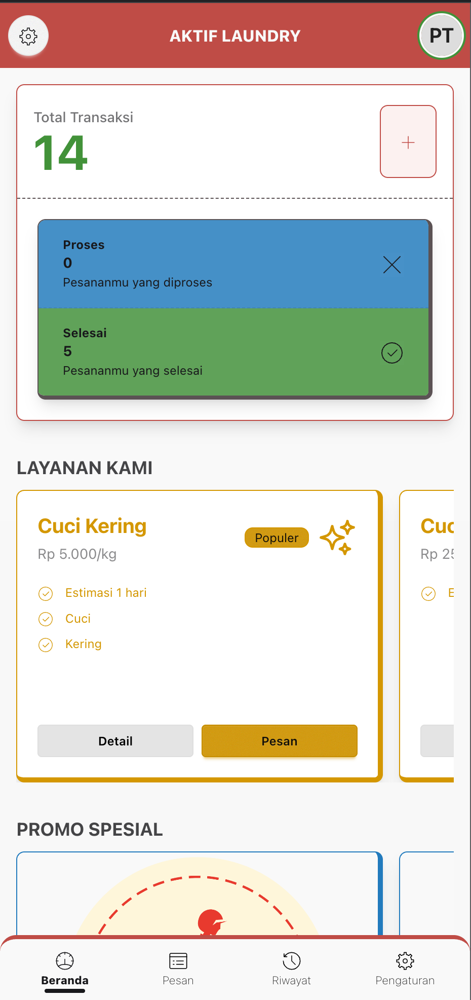
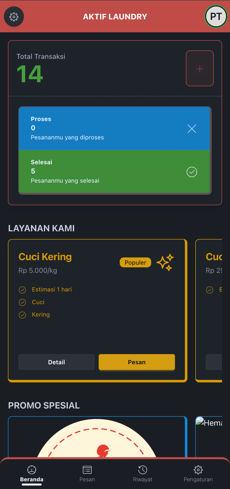

<div align="center">
  

  # Aktif Laundry - Customer Application

  [](https://laravel.com)
  [](https://livewire.laravel.com)
  [](https://web.dev/progressive-web-apps/)
  [](https://tailwindcss.com)
  [](https://mary-ui.com)

  **Progressive Web App untuk Pelanggan Laundry**

  Dibuat oleh [Denis Djodian Ardika](https://github.com/denis156) - Tech Lead at PT. Aktif Global Vision

  [](https://github.com/denis156/aktif-laundry)
</div>

---

## 📋 Daftar Isi

- [Tentang Aplikasi](#-tentang-aplikasi)
- [Fitur Utama](#-fitur-utama)
- [Halaman & Modul](#-halaman--modul)
- [Komponen](#-komponen)
- [PWA Features](#-pwa-features)
- [Teknologi](#-teknologi)

---

## 📱 Tentang Aplikasi

Aplikasi Customer adalah **Progressive Web App (PWA)** yang memungkinkan pelanggan untuk memesan layanan laundry, melacak pesanan, mendapatkan promo, dan menggunakan kode referral. Aplikasi ini dapat diinstall di smartphone seperti aplikasi native dengan pengalaman yang cepat dan responsif.

> **PWA Enabled**: Aplikasi ini dapat diinstall di perangkat mobile (Android & iOS) dan bekerja offline dengan service worker.

### 📸 Screenshots

<div align="center">

#### 🌞 Light Mode


#### 🌙 Dark Mode


</div>

---

## ✨ Fitur Utama

### 🏠 Beranda & Dashboard


- **Statistik Pesanan**: Total transaksi, pesanan dalam proses, dan selesai
- **Quick Order**: Tombol cepat untuk buat pesanan baru
- **List Layanan**: Tampilan katalog layanan dengan harga dan durasi
- **List Promo**: Menampilkan promo aktif yang tersedia
- **Card Referral**: Kartu referral dengan kode unik pelanggan
- **Pesanan Terbaru**: 5 pesanan terakhir customer
- **Auto Refresh**: Real-time update setiap 10 detik

### 🛒 Pemesanan


- **Pilih Layanan**: Browse dan pilih layanan yang diinginkan
- **Detail Layanan**: Informasi lengkap layanan (harga, durasi, include/exclude)
- **Buat Pesanan**: Form pemesanan dengan pilihan metode pembayaran
- **Edit Pesanan**: Edit pesanan yang masih dalam status tertentu
- **Multi-Promo**: Gunakan multiple promo dalam satu pesanan
- **Alamat Penjemputan**: Set lokasi penjemputan dengan peta (Leaflet.js)
- **Jadwal Penjemputan**: Pilih tanggal dan waktu penjemputan

### 📋 Riwayat Pesanan


- **List Pesanan**: Semua riwayat transaksi pelanggan
- **Detail Pesanan**: Informasi lengkap pesanan dengan timeline
- **Status Tracking**: Track status pesanan real-time
- **Filter & Search**: Cari pesanan berdasarkan kode atau tanggal
- **Receipt Digital**: Lihat struk digital pesanan

### 🎁 Promo & Referral


- **Browse Promo**: Lihat semua promo yang tersedia
- **Detail Promo**: Syarat & ketentuan, periode, dan cara pakai promo
- **Auto Apply**: Promo otomatis terapply saat checkout
- **Kode Referral**: Dapatkan kode referral unik untuk dibagikan
- **Referral Tracking**: Lihat statistik referral (total & berhasil)
- **Loyalty Points**: Kumpulkan poin setiap transaksi
- **Member Card**: Nomor kartu member digital

### 👤 Profile & Pengaturan


- **Profile Management**: Update profil, foto, dan data diri
- **Alamat Lengkap**: Simpan alamat dengan koordinat GPS
- **Change Password**: Ubah password akun
- **App Settings**: Pengaturan notifikasi dan preferensi
- **Logout**: Keluar dari akun

### 🔐 Authentication


- **Register**: Daftar akun baru dengan/tanpa kode referral
- **Login**: Masuk ke aplikasi
- **Forgot Password**: Reset password via email
- **Email Verification**: Verifikasi email (optional)
- **Remember Me**: Login otomatis

---

## 🗂️ Halaman & Modul

### Authentication
```
📁 /pelanggan/auth/
  ├── 🆕 register                 # Register page dengan referral code
  ├── 🔐 login                    # Login page
  ├── 🔑 forgot-password          # Forgot password page
  ├── 🔄 reset-password           # Reset password page
  └── ✉️ verify-email             # Email verification page
```

### Main Application
```
📁 /pelanggan/
  ├── 🏠 beranda                  # Dashboard dengan statistik & quick access
  ├── 📋 riwayat                  # Riwayat semua pesanan
  ├── 👤 profile                  # Profile management
  └── ⚙️ pengaturan               # App settings
```

### Order Flow
```
📁 /pelanggan/pesanan/
  ├── 🛍️ pilih-layanan            # Browse dan pilih layanan
  ├── 📝 detail-layanan/{id}      # Detail informasi layanan
  ├── ➕ buat-pesanan             # Form buat pesanan baru
  ├── 👁️ detail-pesanan/{id}      # Detail dan tracking pesanan
  └── ✏️ edit-pesanan/{id}        # Edit pesanan
```

### Promo Module
```
📁 /pelanggan/promo/
  └── 📄 detail-promo/{id}        # Detail promo dengan syarat & ketentuan
```

---

## 🧩 Komponen

Aplikasi Customer dilengkapi dengan komponen-komponen custom untuk pengalaman mobile-first:

### Navigation Components
| Komponen | Deskripsi | Lokasi |
|----------|-----------|--------|
| **Top Nav** | Header navigasi dengan logo dan user info | `pelanggan/component/top-nav` |
| **Bottom Nav** | Bottom navigation bar untuk menu utama | `pelanggan/component/bottom-nav` |

### UI Components
| Komponen | Deskripsi | Lokasi |
|----------|-----------|--------|
| **List Layanan** | Card list layanan dengan icon dan harga | `pelanggan/component/list-layanan` |
| **List Promo** | Carousel/grid promo aktif | `pelanggan/component/list-promo` |
| **Card Referral** | Kartu referral code dengan share button | `pelanggan/component/card-referral` |

---

## 📱 PWA Features

### Progressive Web App Capabilities


#### Installation
- ✅ **Add to Home Screen**: Install aplikasi seperti native app
- ✅ **App Icons**: Icon untuk berbagai ukuran device
- ✅ **Splash Screens**: iOS splash screens untuk semua device
- ✅ **Standalone Mode**: Buka tanpa browser UI

#### iOS Support
- 📱 **iPhone SE, 6, 7, 8**: 640x1136, 750x1294
- 📱 **iPhone 6+, 7+, 8+**: 1242x2148
- 📱 **iPhone X, XS, 11 Pro**: 1125x2436
- 📱 **iPhone XR, 11**: 414x816
- 📱 **iPad 7, 8, 9**: 1536x2048
- 📱 **iPad Pro 10.5**: 1668x2224
- 📱 **iPad Pro 12.9**: 2048x2732

#### Performance
- ⚡ **Fast Loading**: Optimized asset loading
- 🔄 **Auto Refresh**: Real-time data dengan wire:poll
- 📡 **Offline Ready**: Service worker untuk offline access
- 💾 **Cache Strategy**: Smart caching untuk performa optimal

#### Mobile Optimization
- 📱 **Touch Optimized**: Large touch targets untuk mobile
- 🎨 **Responsive Design**: Adaptive layout untuk semua screen size
- 🌈 **Theme Color**: Custom theme color untuk browser bar
- 📍 **Geolocation**: Maps integration dengan Leaflet.js

---

## 🛠️ Teknologi

<div align="center">

### Backend


### Frontend


### PWA & Maps


### Tools


</div>

---

## 🎨 UI/UX Features

### Mobile-First Design


### Theme Support


### User Experience
- ⚡ **SPA Experience**: No page reload dengan Livewire
- 🔄 **Real-time Updates**: Auto-refresh data pesanan
- ✨ **Smooth Animations**: Transisi yang smooth dan natural
- 👆 **Touch Gestures**: Swipe, tap optimized
- 🚀 **Quick Actions**: Floating action button untuk order cepat
- 💬 **Toast Notifications**: Feedback visual untuk setiap aksi
- 📍 **Interactive Maps**: Pilih lokasi dengan drag & drop marker
- 🎯 **Bottom Navigation**: Easy thumb reach navigation
- 📲 **Share Function**: Share kode referral via social media

---

## 🗺️ Maps Integration

### Leaflet.js Features
- 📍 **Interactive Map**: Pilih lokasi penjemputan dengan marker
- 🔍 **Search Location**: Cari alamat atau tempat
- 📌 **Pin Location**: Drag marker untuk set lokasi tepat
- 🗺️ **Multiple Layers**: OpenStreetMap tiles
- 📱 **Mobile Optimized**: Touch gestures untuk zoom & pan
- 💾 **Save Coordinates**: Simpan latitude & longitude untuk tracking

---

## 🔐 Security Features

- 🔒 **Authentication**: Laravel Sanctum untuk session management
- 🛡️ **Data Privacy**: Data pelanggan terenkripsi
- ✅ **CSRF Protection**: Built-in Laravel CSRF protection
- 🔑 **Password Hashing**: Bcrypt password hashing
- 📧 **Email Verification**: Optional email verification
- 🚫 **Account Protection**: Rate limiting untuk login attempts
- 📝 **Transaction History**: Audit trail untuk semua transaksi

---

## 🎯 Customer Journey

### 1️⃣ Registration
```
Unduh PWA → Register → (Opsional) Input Referral Code → Verifikasi Email → Login
```

### 2️⃣ First Order
```
Browse Layanan → Pilih Layanan → Lihat Detail → Buat Pesanan → Pilih Lokasi di Map →
Set Jadwal → Apply Promo → Konfirmasi Pesanan → Selesai
```

### 3️⃣ Track Order
```
Lihat Riwayat → Pilih Pesanan → Lihat Status Real-time → Terima Notifikasi Update
```

### 4️⃣ Referral
```
Buka Card Referral → Copy Kode → Share ke Teman → Teman Register dengan Kode →
Dapat Reward Promo
```

---

## 📊 Customer Features

### Dashboard Metrics
- ✅ **Total Transaksi**: Jumlah semua pesanan
- 🔄 **Pesanan Proses**: Pesanan yang sedang dikerjakan
- ✅ **Pesanan Selesai**: Pesanan yang sudah selesai
- 🏆 **Loyalty Points**: Total poin yang dikumpulkan
- 💳 **Member Card**: Nomor kartu member digital

### Filter & Search
- 🔍 **Search by Kode**: Cari pesanan berdasarkan kode transaksi
- 📆 **Filter by Date**: Filter riwayat berdasarkan tanggal
- 🏷️ **Filter by Status**: Filter berdasarkan status pesanan
- 🗂️ **Sort**: Urutkan berdasarkan tanggal atau total

### Notifications
- 🔔 **Order Updates**: Notifikasi saat status pesanan berubah
- 🎁 **Promo Alerts**: Notifikasi promo baru
- 💰 **Referral Success**: Notifikasi saat referral berhasil
- ⏰ **Pickup Reminder**: Reminder jadwal penjemputan

---

## 🎁 Loyalty & Rewards

### Loyalty System
- 💎 **Earn Points**: Dapatkan poin setiap transaksi
- 🏆 **Member Tiers**: Level keanggotaan berdasarkan poin
- 🎟️ **Redeem Rewards**: Tukar poin dengan diskon
- 📈 **Track Progress**: Lihat progress menuju tier berikutnya

### Referral Rewards
- 🔗 **Unique Referral Code**: Kode unik untuk setiap pelanggan
- 🎁 **Dual Benefits**: Promo untuk referrer & referee
- 📊 **Performance Tracking**: Lihat total referral & conversion
- 🏅 **Leaderboard**: (Future) Ranking top referrers

---

## 📞 Kontak & Support

**Developer**: Denis Djodian Ardika
**Position**: Tech Lead
**Company**: PT. Aktif Global Vision
**Repository**: [github.com/denis156/aktif-laundry](https://github.com/denis156/aktif-laundry)

---

<div align="center">

  **Aktif Laundry Customer App** © 2025 - PT. Aktif Global Vision

  [](https://github.com/denis156/aktif-laundry)
  [](https://github.com/denis156/aktif-laundry)

</div>
