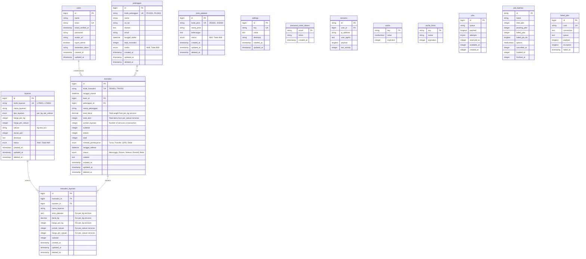

# Database Diagram - Aktif Laundry

## Entity Relationship Diagram



## Table Descriptions

### Core Business Tables

#### 1. users
Tabel untuk menyimpan data pengguna/kasir sistem.
- **Primary Key**: `id`
- **Unique**: `email`
- **Notable Fields**:
  - `avatar_url`: URL foto profil user
  - `super_admin`: Flag untuk super admin

#### 2. pelanggan
Tabel untuk menyimpan data pelanggan laundry.
- **Primary Key**: `id`
- **Unique**: `kode_pelanggan`
- **Notable Fields**:
  - `kode_pelanggan`: Kode unik pelanggan (PLG001, PLG002, dll)
  - `total_transaksi`: Counter total transaksi pelanggan
  - `status`: Status aktif/tidak aktif
- **Soft Deletes**: Ya

#### 3. jenis_pakaian
Tabel master untuk jenis-jenis pakaian.
- **Primary Key**: `id`
- **Unique**: `kode_jenis`
- **Notable Fields**:
  - `kode_jenis`: Kode unik jenis pakaian (JNS001, JNS002, dll)
  - `nama_jenis`: Nama jenis pakaian (Kemeja, Celana, dll)
  - `status`: Status aktif/tidak aktif
- **Soft Deletes**: Ya

#### 4. layanan
Tabel master untuk layanan laundry.
- **Primary Key**: `id`
- **Unique**: `kode_layanan`
- **Notable Fields**:
  - `kode_layanan`: Kode unik layanan (LYN001, LYN002, dll)
  - `tipe_layanan`: Jenis layanan (per_kg atau per_satuan)
  - `harga_per_kg`: Harga untuk layanan per kg
  - `harga_per_satuan`: Harga untuk layanan per satuan/pcs
  - `satuan`: Unit satuan (kg, pcs, lembar, dll)
  - `durasi_jam`: Durasi pengerjaan dalam jam
- **Soft Deletes**: Ya

#### 5. transaksi
Tabel utama untuk transaksi laundry. Satu transaksi bisa memiliki multiple layanan.
- **Primary Key**: `id`
- **Unique**: `kode_transaksi`
- **Foreign Keys**:
  - `kasir_id` -> `users.id` (restrict)
  - `pelanggan_id` -> `pelanggan.id` (restrict)
- **Notable Fields**:
  - `kode_transaksi`: Kode unik transaksi (TRX001, TRX002, dll)
  - `nama_pelanggan`: Denormalized name for performance
  - `total_berat`: Total berat dari semua layanan per_kg
  - `total_item`: Total item dari semua layanan per_satuan
  - `jumlah_layanan`: Jumlah layanan dalam transaksi ini
  - `subtotal`: Subtotal sebelum diskon
  - `diskon`: Diskon dalam Rupiah
  - `total`: Total setelah diskon
  - `metode_pembayaran`: Tunai, Transfer, QRIS, Debit
  - `status`: Menunggu, Proses, Selesai, Diambil, Batal
- **Soft Deletes**: Ya

#### 6. transaksi_layanan
Tabel detail layanan dalam satu transaksi (one-to-many dengan transaksi).
- **Primary Key**: `id`
- **Foreign Keys**:
  - `transaksi_id` -> `transaksi.id` (cascade)
  - `layanan_id` -> `layanan.id` (restrict)
- **Notable Fields**:
  - `nama_layanan`: Denormalized name for performance
  - `jenis_pakaian`: JSON array jenis pakaian (untuk layanan per_kg)
  - `berat_kg`: Berat dalam kg (untuk layanan per_kg)
  - `harga_per_kg`: Harga per kg (untuk layanan per_kg)
  - `jumlah_satuan`: Jumlah item (untuk layanan per_satuan)
  - `harga_per_satuan`: Harga per satuan (untuk layanan per_satuan)
  - `subtotal`: Subtotal untuk layanan ini
- **Soft Deletes**: Ya

#### 7. settings
Tabel untuk menyimpan konfigurasi aplikasi.
- **Primary Key**: `id`
- **Unique**: `key`
- **Notable Fields**:
  - `key`: Kunci setting
  - `value`: Nilai setting
  - `deskripsi`: Deskripsi setting

### Laravel System Tables

#### 8. password_reset_tokens
Tabel untuk token reset password.

#### 9. sessions
Tabel untuk menyimpan session pengguna.

#### 10. cache & cache_locks
Tabel untuk cache aplikasi.

#### 11. jobs, job_batches, failed_jobs
Tabel untuk queue system Laravel.

## Relationships

1. **users → transaksi**: One-to-Many (satu kasir bisa handle banyak transaksi)
2. **pelanggan → transaksi**: One-to-Many (satu pelanggan bisa punya banyak transaksi)
3. **transaksi → transaksi_layanan**: One-to-Many (satu transaksi bisa punya banyak layanan)
4. **layanan → transaksi_layanan**: One-to-Many (satu layanan bisa digunakan di banyak transaksi)

## Business Logic Notes

1. **Multi-Service Transaction**:
   - Sistem mendukung multiple layanan dalam satu transaksi
   - Data layanan disimpan di tabel `transaksi_layanan`
   - Tabel `transaksi` menyimpan summary data

2. **Service Types**:
   - **per_kg**: Layanan berdasarkan berat (contoh: Cuci Reguler, Express)
   - **per_satuan**: Layanan berdasarkan jumlah item (contoh: Bed Cover, Selimut, Seprai)

3. **Denormalization**:
   - `nama_pelanggan` di tabel transaksi untuk performance
   - `nama_layanan` di tabel transaksi_layanan untuk performance

4. **Soft Deletes**:
   - Tabel yang menggunakan soft deletes: `pelanggan`, `jenis_pakaian`, `layanan`, `transaksi`, `transaksi_layanan`

5. **JSON Fields**:
   - `jenis_pakaian` di `transaksi_layanan`: Array of objects dengan format:
     ```json
     [
       {"jenis_id": "1", "nama": "Kemeja", "jumlah": 5},
       {"jenis_id": "2", "nama": "Celana", "jumlah": 3}
     ]
     ```

## Indexes

**pelanggan**: `no_hp`, `email`, `status`
**jenis_pakaian**: `status`
**layanan**: `status`
**transaksi**: `kasir_id`, `pelanggan_id`, `tanggal_masuk`, `tanggal_selesai`, `status`, `metode_pembayaran`
**transaksi_layanan**: `transaksi_id`, `layanan_id`
**sessions**: `user_id`, `last_activity`
**jobs**: `queue`
