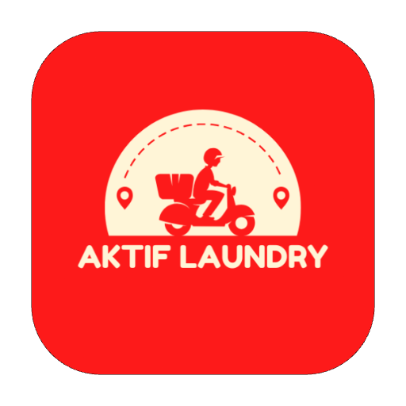

  

  # Aktif Laundry - Database Documentation

  
  
  
  

  **Database Schema & Entity Relationship Diagram**

  Dibuat oleh [Denis Djodian Ardika](https://github.com/denis156) - Tech Lead at PT. Aktif Global Vision

  

---

## 📋 Table of Contents

- [Entity Relationship Diagram](#-entity-relationship-diagram)
- [Core Business Tables](#-core-business-tables)
- [Laravel System Tables](#-laravel-system-tables)
- [Relationships](#-relationships)
- [Business Logic Notes](#-business-logic-notes)
- [Indexes](#-indexes)

---

## 🗄️ Entity Relationship Diagram

```mermaid
erDiagram
    users ||--o{ transaksi : "creates (kasir)"
    users {
        bigint id PK
        string name
        string email UK
        string no_hp UK
        timestamp email_verified_at
        string password
        string avatar_url
        boolean super_admin
        integer gaji
        time jam_masuk
        time jam_keluar
        string bank_name
        string bank_account_number
        string bank_account_name
        text alamat
        text detail_alamat
        string kelurahan
        string kecamatan
        string kabupaten_kota
        string provinsi
        decimal latitude
        decimal longitude
        string remember_token
        timestamp created_at
        timestamp updated_at
    }

    pelanggan ||--o{ transaksi : "has"
    pelanggan ||--o{ referral : "owns"
    pelanggan ||--o{ pelanggan : "refers (self-referential)"
    pelanggan {
        bigint id PK
        string kode_pelanggan UK "PLG001, PLG002"
        string nama
        string no_hp
        string email UK
        timestamp email_verified_at
        string password
        string device_token
        text alamat
        text detail_alamat
        string kelurahan
        string kecamatan
        string kabupaten_kota
        string provinsi
        decimal latitude
        decimal longitude
        datetime tanggal_daftar
        enum status "Aktif, Tidak Aktif"
        integer loyalty_points
        string member_card
        string avatar_url
        bigint direferensikan_oleh FK
        string remember_token
        timestamp created_at
        timestamp updated_at
        timestamp deleted_at
    }

    jenis_pakaian {
        bigint id PK
        string kode_jenis UK "JNS001, JNS002"
        string nama_jenis
        text keterangan
        enum status "Aktif, Tidak Aktif"
        text penanganan_khusus
        string icon
        timestamp created_at
        timestamp updated_at
        timestamp deleted_at
    }

    layanan ||--o{ transaksi_layanan : "used in"
    layanan {
        bigint id PK
        string kode_layanan UK "LYN001, LYN002"
        string nama_layanan
        enum tipe_layanan "per_kg, per_satuan"
        string satuan "kg, pcs, lembar"
        integer harga_per_kg
        integer harga_per_satuan
        integer durasi_jam
        text deskripsi
        enum status "Aktif, Tidak Aktif"
        integer min_order
        integer max_order
        boolean is_popular
        string icon
        json include
        json exclude
        timestamp created_at
        timestamp updated_at
        timestamp deleted_at
    }

    pengaturan {
        bigint id PK
        string key UK
        text value
        enum type "string, number, boolean, json"
        string group
        text deskripsi
        timestamp created_at
        timestamp updated_at
    }

    promo ||--o{ transaksi_promo : "applied in"
    promo ||--o{ referral : "given to referee"
    promo ||--o{ referral : "given to referrer"
    promo {
        bigint id PK
        string kode_promo UK "DISC20, NEWYEAR25"
        string nama_promo
        text deskripsi
        string tipe_diskon "persen, nominal, gratis_kg, gratis_hari, cashback, gratis_ongkir"
        integer nilai_diskon
        integer diskon_maksimal
        integer min_transaksi
        datetime tanggal_mulai
        datetime tanggal_berakhir
        integer kuota_total
        integer kuota_terpakai
        integer max_per_user
        enum berlaku_untuk "semua, pelanggan_baru, pelanggan_lama"
        enum status "Aktif, Tidak Aktif, Habis"
        string banner_image
        text terms_conditions
        boolean auto_apply
        decimal min_berat
        decimal max_berat
        json layanan_ids
        json exclude_pelanggan_ids
        timestamp created_at
        timestamp updated_at
        timestamp deleted_at
    }

    kurir ||--o{ transaksi : "pickup"
    kurir ||--o{ transaksi : "delivery"
    kurir ||--o{ pengiriman : "handles"
    kurir {
        bigint id PK
        string kode_kurir UK "KUR001, KUR002"
        string nama
        string no_hp UK
        string email UK
        text alamat
        text detail_alamat
        string kelurahan
        string kecamatan
        string kabupaten_kota
        string provinsi
        decimal latitude
        decimal longitude
        string no_kendaraan
        enum jenis_kendaraan "Motor, Mobil"
        datetime tanggal_bergabung
        enum status "Aktif, Tidak Aktif, Cuti"
        string bank_name
        string bank_account_number
        string bank_account_name
        string emergency_contact_name
        string emergency_contact_phone
        string emergency_contact_relation
        string avatar_url
        string password
        timestamp email_verified_at
        string device_token
        string remember_token
        timestamp created_at
        timestamp updated_at
        timestamp deleted_at
    }

    referral {
        bigint id PK
        bigint pelanggan_id FK
        string kode_referral UK "REF-ABC123"
        bigint promo_referee_id FK
        bigint promo_referrer_id FK
        integer total_referral
        integer total_berhasil
        string campaign_source
        timestamp created_at
        timestamp updated_at
    }

    transaksi ||--|{ transaksi_layanan : "contains"
    transaksi ||--o{ transaksi_promo : "uses"
    transaksi ||--o{ pengiriman : "has"
    transaksi {
        bigint id PK
        string kode_transaksi UK "TRX001, TRX002"
        datetime tanggal_masuk
        bigint kasir_id FK
        bigint pelanggan_id FK
        bigint referral_id FK
        string nama_pelanggan
        decimal total_berat
        integer total_item
        integer jumlah_layanan
        integer subtotal
        integer total
        enum metode_pembayaran "Bayar Saat Jemput, Bayar Saat Antar"
        enum tipe_bayar "Tunai, Non-Tunai"
        enum status_bayar "Belum Bayar, Menunggu Verifikasi, Sudah Bayar, Ditolak"
        datetime tanggal_bayar
        integer jumlah_bayar
        bigint kurir_jemput_id FK
        bigint kurir_antar_id FK
        datetime tanggal_selesai
        string status "Menunggu, Pengerjaan, Proses, Selesai, Diambil, Batal"
        text catatan
        string kurir_jemput_nama
        string kurir_antar_nama
        text catatan_internal
        json foto_bukti_timbangan
        json foto_bukti_pembayaran
        timestamp created_at
        timestamp updated_at
        timestamp deleted_at
    }

    transaksi_layanan {
        bigint id PK
        bigint transaksi_id FK
        bigint layanan_id FK
        string nama_layanan
        json jenis_pakaian
        decimal berat_kg
        integer harga_per_kg
        integer jumlah_satuan
        integer harga_per_satuan
        integer subtotal
        text catatan_khusus
        timestamp created_at
        timestamp updated_at
        timestamp deleted_at
    }

    transaksi_promo {
        bigint id PK
        bigint transaksi_id FK
        bigint promo_id FK
        string kode_promo
        string nama_promo
        string tipe_diskon
        integer nilai_diskon_persen
        integer nilai_diskon_nominal
        integer diskon_maksimal
        integer gratis_kg
        integer gratis_hari
        enum diterapkan_ke "subtotal, layanan_tertentu"
        bigint layanan_id FK
        tinyint urutan_apply
        timestamp created_at
        timestamp updated_at
        timestamp deleted_at
    }

    pengiriman {
        bigint id PK
        string kode_pengiriman UK "PNG001, PNG002"
        bigint transaksi_id FK
        bigint kurir_id FK
        enum tipe "Jemput, Antar"
        text alamat_tujuan
        string nama_penerima
        string no_hp_penerima
        decimal latitude
        decimal longitude
        datetime jadwal_waktu
        datetime waktu_mulai
        datetime waktu_selesai
        enum status "Menunggu, Dijadwalkan, Dalam Perjalanan, Selesai, Batal"
        text catatan
        string foto_bukti
        decimal lokasi_pickup_latitude
        decimal lokasi_pickup_longitude
        text lokasi_pickup_address
        tinyint review_rating
        text review_text
        json tracking
        timestamp created_at
        timestamp updated_at
        timestamp deleted_at
    }

    messages {
        bigint id PK
        string target
        text message
        string url
        string filename
        string schedule
        string typing
        string delay
        string countryCode
        string file
        string location
        string followup
        timestamp created_at
        timestamp updated_at
    }

    password_reset_tokens {
        string email PK
        string token
        timestamp created_at
    }

    kurir_password_reset_tokens {
        string email PK
        string token
        timestamp created_at
    }

    pelanggan_password_reset_tokens {
        string email PK
        string token
        timestamp created_at
    }

    sessions {
        string id PK
        bigint user_id FK
        string ip_address
        text user_agent
        longtext payload
        integer last_activity
    }

    cache {
        string key PK
        mediumtext value
        integer expiration
    }

    cache_locks {
        string key PK
        string owner
        integer expiration
    }

    jobs {
        bigint id PK
        string queue
        longtext payload
        tinyint attempts
        integer reserved_at
        integer available_at
        integer created_at
    }

    job_batches {
        string id PK
        string name
        integer total_jobs
        integer pending_jobs
        integer failed_jobs
        longtext failed_job_ids
        mediumtext options
        integer cancelled_at
        integer created_at
        integer finished_at
    }

    failed_jobs {
        bigint id PK
        string uuid UK
        text connection
        text queue
        longtext payload
        longtext exception
        timestamp failed_at
    }
```

---

## 📊 Table Descriptions

### 🏢 Core Business Tables

#### 1. users
Tabel untuk menyimpan data pengguna/kasir/staf sistem.
- **Primary Key**: `id`
- **Unique**: `email`, `no_hp`
- **Notable Fields**:
  - `avatar_url`: URL foto profil user
  - `super_admin`: Flag untuk super admin
  - `gaji`: Gaji pokok pegawai
  - `jam_masuk`, `jam_keluar`: Jam kerja
  - `bank_name`, `bank_account_number`, `bank_account_name`: Data bank untuk penggajian
  - `alamat`, `detail_alamat`, `kelurahan`, `kecamatan`, `kabupaten_kota`, `provinsi`: Alamat lengkap
  - `latitude`, `longitude`: Koordinat GPS
- **Indexes**: `no_hp`, `email`, `kelurahan`, `kecamatan`, composite index `(latitude, longitude)`

#### 2. pelanggan
Tabel untuk menyimpan data pelanggan laundry.
- **Primary Key**: `id`
- **Unique**: `kode_pelanggan`, `email`
- **Foreign Keys**:
  - `direferensikan_oleh` -> `pelanggan.id` (set null) - Self-referential untuk referral
- **Notable Fields**:
  - `kode_pelanggan`: Kode unik pelanggan (PLG001, PLG002, dll)
  - `password`: Password untuk login aplikasi customer (optional)
  - `device_token`: Token untuk push notification
  - `loyalty_points`: Poin loyalty pelanggan
  - `member_card`: Nomor kartu member
  - `direferensikan_oleh`: ID pelanggan yang mereferensikan
  - Alamat lengkap dengan koordinat GPS
- **Soft Deletes**: Ya
- **Indexes**: `kode_pelanggan`, `no_hp`, `email`, `status`, `loyalty_points`, `direferensikan_oleh`, `kelurahan`, `kecamatan`, composite indexes untuk status+tanggal dan koordinat

#### 3. jenis_pakaian
Tabel master untuk jenis-jenis pakaian.
- **Primary Key**: `id`
- **Unique**: `kode_jenis`
- **Notable Fields**:
  - `kode_jenis`: Kode unik jenis pakaian (JNS001, JNS002, dll)
  - `nama_jenis`: Nama jenis pakaian (Kemeja, Celana, dll)
  - `penanganan_khusus`: Instruksi penanganan khusus
  - `icon`: Icon untuk UI (iconpark format)
- **Soft Deletes**: Ya
- **Indexes**: `kode_jenis`, `status`

#### 4. layanan
Tabel master untuk layanan laundry.
- **Primary Key**: `id`
- **Unique**: `kode_layanan`
- **Notable Fields**:
  - `kode_layanan`: Kode unik layanan (LYN001, LYN002, dll)
  - `tipe_layanan`: Jenis layanan (per_kg atau per_satuan)
  - `harga_per_kg`: Harga untuk layanan per kg
  - `harga_per_satuan`: Harga untuk layanan per satuan/pcs
  - `satuan`: Unit satuan (kg, pcs, lembar, dll)
  - `durasi_jam`: Durasi pengerjaan dalam jam
  - `min_order`, `max_order`: Batas minimum dan maksimum order
  - `is_popular`: Flag layanan populer
  - `icon`: Icon untuk UI
  - `include`: JSON array item yang termasuk dalam layanan
  - `exclude`: JSON array item yang tidak termasuk
- **Soft Deletes**: Ya
- **Indexes**: `kode_layanan`, `tipe_layanan`, `status`, `is_popular`

#### 5. pengaturan
Tabel untuk menyimpan konfigurasi aplikasi.
- **Primary Key**: `id`
- **Unique**: `key`
- **Notable Fields**:
  - `key`: Kunci setting
  - `value`: Nilai setting
  - `type`: Tipe data (string, number, boolean, json)
  - `group`: Grup untuk organisasi (general, payment, notification, dll)
- **Indexes**: `key`, `group`

#### 6. promo
Tabel untuk menyimpan data promo/diskon.
- **Primary Key**: `id`
- **Unique**: `kode_promo`
- **Notable Fields**:
  - `kode_promo`: Kode unik promo (DISC20, NEWYEAR25, dll)
  - `tipe_diskon`: persen, nominal, gratis_kg, gratis_hari, cashback, gratis_ongkir
  - `nilai_diskon`: Nilai diskon (20 untuk 20% atau 50000 untuk Rp 50.000)
  - `diskon_maksimal`: Maksimal diskon jika pakai persen
  - `min_transaksi`: Minimum belanja untuk mendapat promo
  - `tanggal_mulai`, `tanggal_berakhir`: Periode promo
  - `kuota_total`, `kuota_terpakai`: Limit penggunaan
  - `max_per_user`: Maksimal penggunaan per user
  - `berlaku_untuk`: semua, pelanggan_baru, pelanggan_lama
  - `auto_apply`: Apakah promo otomatis terapply
  - `min_berat`, `max_berat`: Batas berat untuk promo
  - `layanan_ids`: JSON array ID layanan yang eligible
  - `exclude_pelanggan_ids`: JSON array ID pelanggan yang dikecualikan
- **Soft Deletes**: Ya
- **Indexes**: `kode_promo`, `status`, `tanggal_mulai`, `tanggal_berakhir`, `berlaku_untuk`, `auto_apply`, composite indexes

#### 7. kurir
Tabel untuk menyimpan data kurir.
- **Primary Key**: `id`
- **Unique**: `kode_kurir`, `no_hp`, `email`
- **Notable Fields**:
  - `kode_kurir`: Kode unik kurir (KUR001, KUR002, dll)
  - `no_kendaraan`: Plat nomor kendaraan
  - `jenis_kendaraan`: Motor atau Mobil
  - `status`: Aktif, Tidak Aktif, Cuti
  - `bank_name`, `bank_account_number`, `bank_account_name`: Data bank untuk penggajian
  - `emergency_contact_*`: Data kontak darurat untuk safety
  - `password`: Untuk login di app courier
  - `device_token`: Token untuk push notification
  - Alamat lengkap dengan koordinat GPS
- **Soft Deletes**: Ya
- **Indexes**: `kode_kurir`, `no_hp`, `email`, `status`, composite indexes untuk status+tanggal dan koordinat

#### 8. referral
Tabel untuk sistem referral pelanggan.
- **Primary Key**: `id`
- **Unique**: `kode_referral`
- **Foreign Keys**:
  - `pelanggan_id` -> `pelanggan.id` (cascade)
  - `promo_referee_id` -> `promo.id` (null on delete) - Promo untuk yang pakai kode
  - `promo_referrer_id` -> `promo.id` (null on delete) - Promo untuk pemilik kode
- **Notable Fields**:
  - `kode_referral`: Kode referral unik (REF-ABC123)
  - `total_referral`: Berapa orang yang pakai kode ini
  - `total_berhasil`: Berapa referral yang berhasil transaksi
  - `campaign_source`: Source campaign (instagram, facebook, whatsapp, dll)
- **Indexes**: `pelanggan_id`, `kode_referral`, `promo_referee_id`, `promo_referrer_id`

#### 9. transaksi
Tabel utama untuk transaksi laundry. Satu transaksi bisa memiliki multiple layanan.
- **Primary Key**: `id`
- **Unique**: `kode_transaksi`
- **Foreign Keys**:
  - `kasir_id` -> `users.id` (restrict) - Nullable untuk order dari pelanggan langsung
  - `pelanggan_id` -> `pelanggan.id` (restrict)
  - `referral_id` -> `referral.id` (null on delete)
  - `kurir_jemput_id` -> `kurir.id` (set null)
  - `kurir_antar_id` -> `kurir.id` (set null)
- **Notable Fields**:
  - `kode_transaksi`: Kode unik transaksi (TRX001, TRX002, dll)
  - `nama_pelanggan`: Snapshot nama pelanggan saat transaksi
  - `total_berat`: Total berat dari semua layanan per_kg
  - `total_item`: Total item dari semua layanan per_satuan
  - `jumlah_layanan`: Jumlah layanan dalam transaksi
  - `subtotal`: Subtotal sebelum diskon
  - `total`: Total setelah diskon
  - `metode_pembayaran`: Bayar Saat Jemput atau Bayar Saat Antar
  - `tipe_bayar`: Tunai atau Non-Tunai
  - `status_bayar`: Belum Bayar, Menunggu Verifikasi, Sudah Bayar, Ditolak
  - `status`: Menunggu, Pengerjaan, Proses, Selesai, Diambil, Batal
  - `kurir_jemput_nama`, `kurir_antar_nama`: Snapshot nama kurir
  - `foto_bukti_timbangan`: JSON array URL foto timbangan
  - `foto_bukti_pembayaran`: JSON array URL foto bukti transfer/QRIS
- **Soft Deletes**: Ya
- **Indexes**: Multiple indexes untuk optimasi query (lihat migrasi)

#### 10. transaksi_layanan
Tabel detail layanan dalam satu transaksi (one-to-many dengan transaksi).
- **Primary Key**: `id`
- **Foreign Keys**:
  - `transaksi_id` -> `transaksi.id` (cascade)
  - `layanan_id` -> `layanan.id` (restrict)
- **Notable Fields**:
  - `nama_layanan`: Snapshot nama layanan saat transaksi
  - `jenis_pakaian`: JSON array jenis pakaian (untuk layanan per_kg)
  - `berat_kg`: Berat dalam kg (untuk layanan per_kg)
  - `harga_per_kg`: Harga per kg (untuk layanan per_kg)
  - `jumlah_satuan`: Jumlah item (untuk layanan per_satuan)
  - `harga_per_satuan`: Harga per satuan (untuk layanan per_satuan)
  - `subtotal`: Subtotal untuk layanan ini
  - `catatan_khusus`: Catatan khusus untuk layanan ini
- **Soft Deletes**: Ya
- **Indexes**: `transaksi_id`, `layanan_id`, composite index

#### 11. transaksi_promo
Tabel pivot untuk promo yang digunakan dalam transaksi (many-to-many).
- **Primary Key**: `id`
- **Foreign Keys**:
  - `transaksi_id` -> `transaksi.id` (cascade)
  - `promo_id` -> `promo.id` (restrict)
  - `layanan_id` -> `layanan.id` (null on delete)
- **Notable Fields**:
  - Snapshot data promo saat transaksi dibuat (untuk audit trail)
  - `kode_promo`, `nama_promo`: Snapshot nama promo
  - `nilai_diskon_persen`, `nilai_diskon_nominal`: Nilai diskon
  - `gratis_kg`, `gratis_hari`: Benefit gratis
  - `diterapkan_ke`: subtotal atau layanan_tertentu
  - `urutan_apply`: Urutan apply promo jika ada multiple promo
- **Soft Deletes**: Ya
- **Indexes**: `transaksi_id`, `promo_id`, `layanan_id`, composite indexes

#### 12. pengiriman
Tabel untuk tracking pengiriman/pengambilan cucian.
- **Primary Key**: `id`
- **Unique**: `kode_pengiriman`
- **Foreign Keys**:
  - `transaksi_id` -> `transaksi.id` (cascade)
  - `kurir_id` -> `kurir.id` (set null)
- **Notable Fields**:
  - `kode_pengiriman`: Kode unik pengiriman (PNG001, PNG002, dll)
  - `tipe`: Jemput atau Antar
  - `alamat_tujuan`, `nama_penerima`, `no_hp_penerima`: Info tujuan
  - `latitude`, `longitude`: Koordinat GPS tujuan
  - `jadwal_waktu`: Waktu dijadwalkan
  - `waktu_mulai`, `waktu_selesai`: Timeline pengiriman
  - `status`: Menunggu, Dijadwalkan, Dalam Perjalanan, Selesai, Batal
  - `foto_bukti`: Foto bukti delivery
  - `lokasi_pickup_*`: Data lokasi pickup
  - `review_rating`, `review_text`: Review dari customer
  - `tracking`: JSON array tracking points
- **Soft Deletes**: Ya
- **Indexes**: Multiple indexes untuk optimasi query

#### 13. messages
Tabel untuk menyimpan log/queue pesan WhatsApp (integrasi dengan Fonnte).
- **Primary Key**: `id`
- **Notable Fields**:
  - `target`: Target nomor WhatsApp
  - `message`: Isi pesan
  - `url`, `filename`, `file`: Data file/media
  - `schedule`: Jadwal pengiriman
  - `typing`, `delay`: Simulasi typing
  - `countryCode`: Kode negara
  - `location`: Data lokasi
  - `followup`: Data follow-up

---

### ⚙️ Laravel System Tables

#### 14. password_reset_tokens
Tabel untuk token reset password users.

#### 15. kurir_password_reset_tokens
Tabel untuk token reset password kurir.

#### 16. pelanggan_password_reset_tokens
Tabel untuk token reset password pelanggan.

#### 17. sessions
Tabel untuk menyimpan session pengguna.

#### 18. cache & cache_locks
Tabel untuk cache aplikasi.

#### 19. jobs, job_batches, failed_jobs
Tabel untuk queue system Laravel.

---

## 🔗 Relationships

### Primary Relationships

1. **users → transaksi**: One-to-Many (satu kasir bisa handle banyak transaksi)
2. **pelanggan → transaksi**: One-to-Many (satu pelanggan bisa punya banyak transaksi)
3. **pelanggan → referral**: One-to-Many (satu pelanggan bisa punya banyak kode referral)
4. **pelanggan → pelanggan**: Self-referential (pelanggan bisa direferensikan oleh pelanggan lain)
5. **kurir → transaksi**: One-to-Many (satu kurir bisa jemput/antar banyak transaksi)
6. **kurir → pengiriman**: One-to-Many (satu kurir bisa handle banyak pengiriman)
7. **transaksi → transaksi_layanan**: One-to-Many (satu transaksi bisa punya banyak layanan)
8. **transaksi → transaksi_promo**: One-to-Many (satu transaksi bisa pakai banyak promo)
9. **transaksi → pengiriman**: One-to-Many (satu transaksi bisa punya banyak pengiriman)
10. **layanan → transaksi_layanan**: One-to-Many (satu layanan bisa digunakan di banyak transaksi)
11. **promo → transaksi_promo**: One-to-Many (satu promo bisa digunakan di banyak transaksi)
12. **promo → referral**: One-to-Many (satu promo bisa digunakan di banyak referral)
13. **referral → pelanggan**: Many-to-One (banyak referral dimiliki satu pelanggan)

---

## 💡 Business Logic Notes

### 1. Multi-Service Transaction

   - Sistem mendukung multiple layanan dalam satu transaksi
   - Data layanan disimpan di tabel `transaksi_layanan`
   - Tabel `transaksi` menyimpan summary data

### 2. Service Types

   - **per_kg**: Layanan berdasarkan berat (contoh: Cuci Reguler, Express)
   - **per_satuan**: Layanan berdasarkan jumlah item (contoh: Bed Cover, Selimut, Seprai)

### 3. Payment System

   - `metode_pembayaran`: Kapan customer bayar (saat jemput atau saat antar)
   - `tipe_bayar`: Bagaimana customer bayar (Tunai atau Non-Tunai)
   - `status_bayar`: Status pembayaran dengan verifikasi
   - Mendukung bukti pembayaran untuk Non-Tunai (foto transfer/QRIS)

### 4. Delivery System

   - Tracking pengiriman dengan GPS
   - Review system untuk kurir
   - Bukti foto delivery
   - Timeline pengiriman lengkap

### 5. Referral System

   - Pelanggan bisa memiliki kode referral sendiri
   - Bisa memberikan promo berbeda untuk referee dan referrer
   - Tracking performa referral (total dan berhasil)
   - Campaign tracking untuk analytics

### 6. Promo System

   - Multiple tipe diskon: persen, nominal, gratis_kg, gratis_hari, cashback, gratis_ongkir
   - Bisa ditargetkan ke pelanggan tertentu (baru/lama)
   - Bisa dibatasi untuk layanan tertentu
   - Auto-apply untuk promo otomatis
   - Satu transaksi bisa pakai multiple promo dengan urutan prioritas

### 7. Location Tracking

   - User, pelanggan, dan kurir memiliki data alamat lengkap + koordinat GPS
   - Mendukung pencarian berdasarkan lokasi
   - Pengiriman memiliki tracking GPS realtime

### 8. Denormalization

   - `nama_pelanggan` di tabel transaksi untuk performance
   - `nama_layanan` di tabel transaksi_layanan untuk performance
   - `kurir_jemput_nama`, `kurir_antar_nama` di transaksi untuk snapshot data
   - Snapshot data promo di transaksi_promo untuk audit trail

### 9. Soft Deletes

   - Tabel yang menggunakan soft deletes: `pelanggan`, `jenis_pakaian`, `layanan`, `kurir`, `promo`, `referral`, `transaksi`, `transaksi_layanan`, `transaksi_promo`, `pengiriman`

### 10. JSON Fields

   - `jenis_pakaian` di `transaksi_layanan`: Array of objects jenis pakaian
   - `include`, `exclude` di `layanan`: Array item yang termasuk/dikecualikan
   - `layanan_ids`, `exclude_pelanggan_ids` di `promo`: Array ID filter
   - `foto_bukti_timbangan`, `foto_bukti_pembayaran` di `transaksi`: Array URL foto
   - `tracking` di `pengiriman`: Array tracking points

### 11. Multi-App Authentication

   - `users`: Untuk admin/kasir/staf (login ke dashboard admin)
   - `kurir`: Untuk kurir (login ke aplikasi courier)
   - `pelanggan`: Untuk customer (login ke aplikasi customer - optional)
   - Masing-masing memiliki password reset tokens terpisah

### 12. Messaging Integration

   - Tabel `messages` untuk integrasi WhatsApp via Fonnte API
   - Mendukung scheduling, typing simulation, media files

---

## 📑 Indexes

Indexes telah dibuat untuk optimasi query pada setiap tabel:

### Master Data Indexes
- **users**: `no_hp`, `email`, `kelurahan`, `kecamatan`, `(latitude, longitude)`
- **pelanggan**: `kode_pelanggan`, `no_hp`, `email`, `status`, `loyalty_points`, `direferensikan_oleh`, `kelurahan`, `kecamatan`, `(status, tanggal_daftar)`, `(latitude, longitude)`
- **jenis_pakaian**: `kode_jenis`, `status`
- **layanan**: `kode_layanan`, `tipe_layanan`, `status`, `is_popular`
- **kurir**: `kode_kurir`, `no_hp`, `email`, `status`, `(status, tanggal_bergabung)`, `(latitude, longitude)`

### Settings & Promo Indexes
- **pengaturan**: `key`, `group`
- **promo**: `kode_promo`, `status`, `tanggal_mulai`, `tanggal_berakhir`, `berlaku_untuk`, `auto_apply`, `(tanggal_mulai, tanggal_berakhir)`, `(min_berat, max_berat)`
- **referral**: `pelanggan_id`, `kode_referral`, `promo_referee_id`, `promo_referrer_id`

### Transaction Indexes
- **transaksi**: `kode_transaksi`, `kasir_id`, `pelanggan_id`, `referral_id`, `tanggal_masuk`, `tanggal_selesai`, `status`, `metode_pembayaran`, `status_bayar`, `tanggal_bayar`, `kurir_jemput_id`, `kurir_antar_id`, plus multiple composite indexes
- **transaksi_layanan**: `transaksi_id`, `layanan_id`, `(transaksi_id, layanan_id)`
- **transaksi_promo**: `transaksi_id`, `promo_id`, `layanan_id`, `(transaksi_id, promo_id)`, `(transaksi_id, urutan_apply)`
- **pengiriman**: `kode_pengiriman`, `transaksi_id`, `kurir_id`, `status`, `tipe`, `jadwal_waktu`, `review_rating`, plus multiple composite indexes

### System Indexes
- **sessions**: `user_id`, `last_activity`
- **jobs**: `queue`

---

## 📊 Database Statistics

| Category | Tables | Total Fields | Relationships |
|----------|--------|--------------|---------------|
| **Core Business** | 13 | 150+ | 13 |
| **Laravel System** | 10 | 40+ | 2 |
| **Total** | **23** | **190+** | **15** |

### Key Metrics
- ✅ **Soft Deletes**: 9 tables untuk data recovery
- ✅ **JSON Fields**: 8 kolom untuk flexible data
- ✅ **GPS Tracking**: 7 tables dengan lat/long
- ✅ **Composite Indexes**: 25+ untuk query optimization
- ✅ **Foreign Keys**: 20+ dengan proper constraints
- ✅ **Timestamps**: Semua tables dengan created_at & updated_at

---

## 📞 Kontak & Support

**Developer**: Denis Djodian Ardika
**Position**: Tech Lead
**Company**: PT. Aktif Global Vision
**Repository**: [github.com/denis156/aktif-laundry](https://github.com/denis156/aktif-laundry)

---

  **Aktif Laundry Database** © 2025 - PT. Aktif Global Vision

  
  
  

