# Panduan Pengguna Aplikasi Kurir SiAktif

**Versi:** 1.0
**Tanggal:** Januari 2026

---

## Daftar Isi

1. [Pendahuluan](#pendahuluan)
2. [Cara Install Aplikasi](#cara-install-aplikasi)
3. [Login & Autentikasi](#login--autentikasi)
4. [Navigasi Aplikasi](#navigasi-aplikasi)
5. [Menu Utama](#menu-utama)
6. [Panduan Detail Fitur Penting](#panduan-detail-fitur-penting)
7. [Tips & Trik](#tips--trik)
8. [FAQ](#faq)

---

## Pendahuluan

### 🎉 Halo Pahlawan Laundry! Selamat Datang di SiAktif!

Yup, **PAHLAWAN**! Karena kalian yang bikin baju kotor jadi bersih sampai ke tangan pelanggan.

Dokumentasi ini bakal bantuin kamu jadi kurir super yang **gak pernah nyasar**, **gak pernah lewatin pesanan**, dan **selalu on time** (kecuali macet parah, itu mah beda cerita 😅).

### 🚀 Kenapa Aplikasi Ini Keren?

Bayangin deh, dulu nganter laundry itu ribet:
- ❌ Bawa kertas pesanan yang bisa ilang/basah kena hujan
- ❌ Tanya-tanya jalan, GPS-nya cuma "ikuti kata hati"
- ❌ Bolak-balik nelpon admin buat konfirmasi
- ❌ Nyatet manual pake pulpen (trus pulpennya ilang 🙃)

**SEKARANG?** Semua ada di genggaman! 📱

### ✨ Fitur Andalan yang Bikin Hidup Lebih Mudah:
- 📍 **GPS & Navigasi Real-time** - Gak bakal nyasar lagi! Petunjuk arah langsung ke lokasi pelanggan. Bye-bye tanya "Alamatnya dimana pak/bu?"
- 📦 **Kelola Pesanan** - Satu klik, pesanan langsung masuk kantong. Cepet banget kayak kilat! ⚡
- 💬 **Chat Langsung** - Chat sama admin atau pelanggan tanpa keluar aplikasi. No more bolak-balik buka WhatsApp!
- 📸 **Upload Bukti Bayar** - Foto, upload, selesai. Gak perlu lagi fotoin struk terus kirim manual satu-satu
- 🔔 **Notifikasi Push** - Pesanan baru? Langsung ada notif! Jadi gak ada yang kelewat
- 📱 **PWA (Install kayak App Beneran)** - Taruh di home screen, buka langsung tanpa browser. Keren kan? 😎

> **Fun Fact:** Aplikasi ini lebih irit kuota dari stalking mantan. Dijamin! 🤭

---

## Cara Install Aplikasi

### 📲 Install Dulu Biar Makin Pro!

Aplikasi ini bisa diinstall ke home screen HP kamu. Jadi nanti bukanya gak pake ribet masuk browser dulu. Langsung klik aja kayak buka Instagram! 📱✨

<p align="center">
  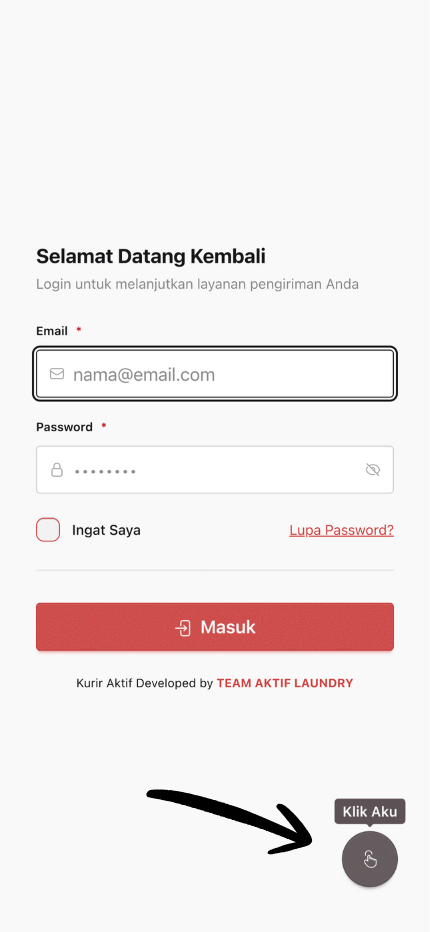
</p>

### Instalasi Otomatis (Gampang Banget!)

1. Buka aplikasi di browser (Chrome/Safari)
2. Liat ada **tombol biru melayang** di kanan bawah? Yang loncat-loncat lucu itu loh 👆
3. Klik tombolnya, nanti muncul pop-up keren
4. Klik **"Install Sekarang"**
5. BOOM! 💥 Aplikasi udah di home screen

<p align="center">
  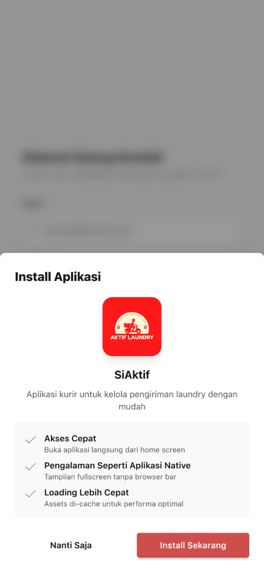
</p>

> **Pro Tip:** Setelah install, tombol biru tadi bakal ilang sendiri. Dia tau diri kok, udah gak dibutuhin lagi 😄

### Instalasi Manual (Kalo yang otomatis ngambek)

#### Untuk Pengguna Android (Chrome/Brave):
1. Tap titik 3 di pojok kanan atas **(⋮)**
2. Cari **"Install app"** atau **"Add to Home screen"** (biasanya di tengah-tengah)
3. Tap **"Install"**
4. Cek home screen, udah ada kan? Kalo belum coba scroll, mungkin nyasar 🤭

#### Untuk Pengguna iOS (Safari):
1. Tap ikon **Share (📤)** di bagian bawah (yang kayak kotak dengan anak panah ke atas)
2. Scroll ke bawah, cari **"Add to Home Screen"**
3. Tap **"Add"**
4. Selesai! Aplikasi udah mejeng di home screen bareng app lainnya

> **Catatan:** Kalo masih bingung, tanya anak/ponakan/tetangga yang jago. Atau chat admin aja, gak usah malu! 😊

---

## Login & Autentikasi

<p align="center">
  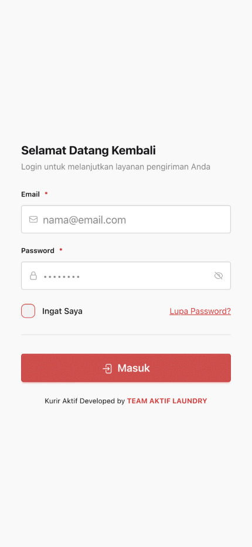
</p>

### Cara Login

1. Buka aplikasi SiAktif Kurir
2. Masukkan **Email** dan **Password** yang telah diberikan oleh admin
3. (Opsional) Centang **"Ingat Saya"** agar tidak perlu login berulang
4. Klik tombol **"Masuk"**

### Lupa Password (Klasik! 😅)

Tenang, kita semua pernah di posisi ini. Password itu kayak janji mantan, susah diinget 🤷‍♂️

1. Klik link **"Lupa Password?"** di halaman login
2. Masukkan email kamu (yang masih aktif ya, bukan email jaman SMP)
3. Klik **"Kirim Link Reset"**
4. Cek inbox email. **Gak ada?** Cek folder **Spam/Junk** dulu! (sering banget kesana soalnya)
5. Klik link yang ada di email
6. Bikin password baru (yang gampang diinget tapi susah ditebak orang)
7. Login lagi deh!

> **Pro Tip:** Jangan pake password "123456" atau "password". Itu mah kayak kunci rumah ditaro di bawah keset 🔑

### Verifikasi Email

Email harus diverifikasi dulu biar akun kamu aman (dan biar admin yakin kamu bukan robot 🤖):

1. Setelah login pertama kali, bakal muncul halaman verifikasi
2. Buka email kamu, cek inbox (atau Spam, lagi-lagi)
3. Klik link verifikasi yang ada di email
4. Kalo emailnya gak masuk-masuk, klik **"Kirim Ulang"**

> **Catatan:** Tombol "Kirim Ulang" ada cooldown 1 menit. Jadi jangan di-spam ya, kasian servernya capek 😴

---

## Navigasi Aplikasi

Aplikasi memiliki 2 area navigasi utama:

### Top Navigation (Navigasi Atas)

<p align="center">
  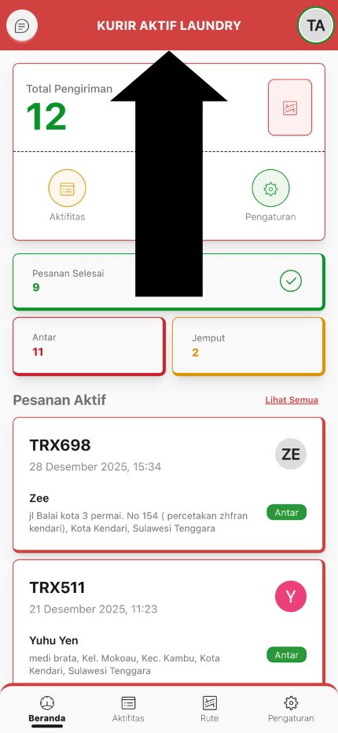
</p>

- **Ikon Chat** (kiri) - Akses halaman chat, dengan badge notifikasi pesan belum dibaca
- **Logo "KURIR SIAKTIF"** (tengah) - Identitas aplikasi
- **Avatar Profil** (kanan) - Akses halaman profil Anda

### Bottom Navigation (Navigasi Bawah)

<p align="center">
  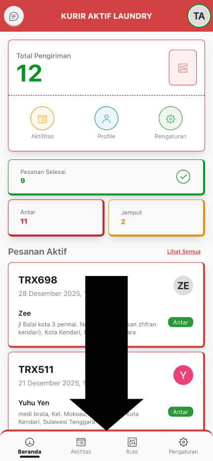
</p>

Terdapat 4 menu utama:

1. **Beranda** - Dashboard dan ringkasan aktifitas
2. **Aktifitas** - Daftar semua pesanan jemput dan antar
3. **Rute** - Pesanan aktif dengan navigasi peta
4. **Pengaturan** - Pengaturan aplikasi dan profil

> Menu yang aktif ditandai dengan **warna lebih gelap** dan **font lebih tebal**.

---

## Menu Utama

### 1. Beranda

Halaman dashboard yang menampilkan ringkasan pekerjaan Anda.

<p align="center">
  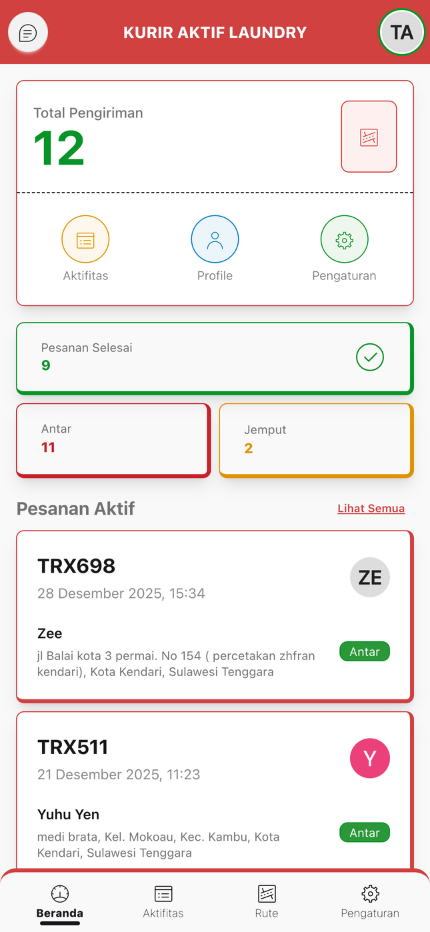
</p>

**Informasi yang ditampilkan:**

#### Statistik Utama
- **Total Pengiriman** - Jumlah total pesanan yang Anda tangani
- Tombol cepat ke: Aktifitas, Profile, Pengaturan

#### Mini Statistik
- **Pesanan Selesai** - Pesanan yang sudah diantar dan diambil pelanggan
- **Antar** - Jumlah pesanan yang Anda antar
- **Jemput** - Jumlah pesanan yang Anda jemput

#### Pesanan Aktif (Maksimal 3)
Menampilkan pesanan yang sedang Anda kerjakan:
- Badge **"Jemput"** (kuning) - Pesanan yang sedang dijemput (status: Proses)
- Badge **"Antar"** (hijau) - Pesanan yang sedang diantar (status: Selesai)

#### Aktifitas Terbaru (Maksimal 3)
Menampilkan 3 pesanan terbaru dengan:
- Kode transaksi
- Nama layanan
- Jumlah (kg/pcs)
- Nama pelanggan
- Status pesanan

> Klik **"Lihat Semua"** untuk melihat daftar lengkap.

---

### 2. Aktifitas

Halaman yang menampilkan semua pesanan yang dapat Anda jemput atau antar.

<p align="center">
  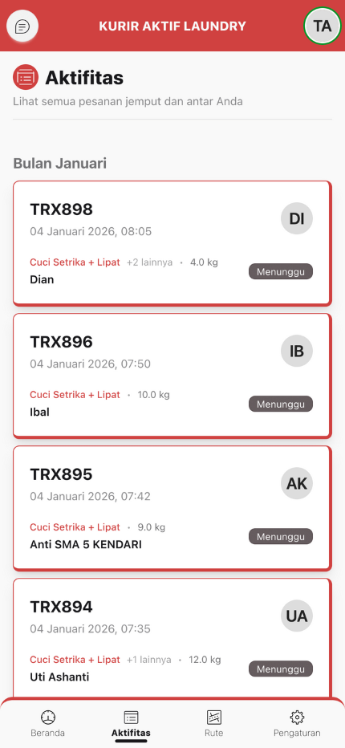
</p>

**Fitur:**
- **Pengelompokan per Periode**: Hari Ini, Minggu Ini, Bulan Ini, dll
- **Auto-refresh setiap 10 detik** - Data selalu update
- **Load More** - Tombol "Lebih Banyak" untuk muat lebih banyak data
- **Load Less** - Tombol "Lebih Sedikit" untuk kurangi data yang ditampilkan

**Informasi di setiap card:**
- Kode transaksi
- Tanggal & waktu masuk
- Nama layanan + jumlah layanan lainnya
- Quantity (kg/pcs)
- Nama pelanggan
- Avatar pelanggan
- Badge status (Menunggu/Proses/Selesai/Diambil)

**Klik card** untuk melihat detail pesanan.

---

### 3. Rute

Halaman untuk melihat pesanan yang sedang Anda kerjakan dengan peta lokasi.

<p align="center">
  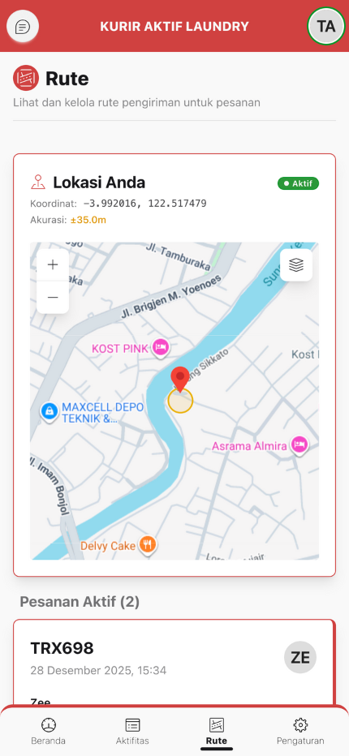
</p>

**Fitur:**
- **Peta "Lokasi Saya"** - Menampilkan posisi GPS Anda saat ini
- **Status GPS** - Indikator status GPS (Aktif/Mencari/Error)
- **Koordinat Real-time** - Latitude & Longitude Anda
- **Akurasi GPS** - Akurasi posisi dalam meter
- **Waktu Update** - Kapan terakhir posisi diupdate

**Daftar Pesanan Aktif:**
- Hanya menampilkan pesanan yang sedang Anda jemput (status: Proses) atau antar (status: Selesai)
- Badge "Jemput" atau "Antar"
- Alamat pelanggan
- Klik untuk membuka **navigasi detail**

> **Auto-refresh setiap 10 detik** untuk memastikan data selalu update.

---

### 4. Chat

Halaman untuk berkomunikasi dengan Admin dan Pelanggan.

<p align="center">
  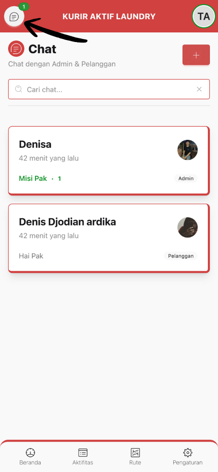
</p>

**Fitur:**
- **Search** - Cari percakapan berdasarkan nama atau isi pesan
- **Badge Unread** - Indikator jumlah pesan belum dibaca
- **Badge Tipe** - Menampilkan tipe participant (Admin/Pelanggan)
- **Last Message** - Pesan terakhir & waktu
- **Status Online/Offline** - Avatar dengan indikator online

**Buat Chat Baru:**
1. Klik tombol **"Buat Chat"**
2. Pilih **Tipe Participant** (Admin atau Pelanggan)
3. Pilih **Participant** dari dropdown
4. Klik **"Buat Chat"**

**Klik percakapan** untuk membuka chat room.

---

### 5. Pengaturan

Halaman untuk mengatur aplikasi dan profil Anda.

<p align="center">
  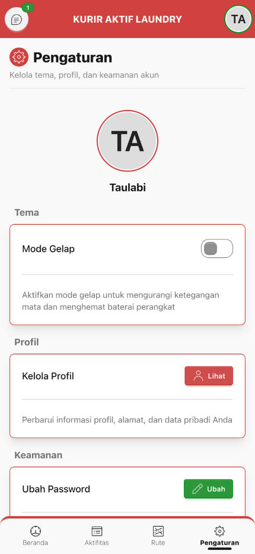
</p>

**Fitur yang tersedia:**

#### Tema
- **Mode Gelap** - Toggle untuk mengaktifkan/menonaktifkan dark mode
- Mengurangi ketegangan mata dan menghemat baterai

#### Profil
- **Kelola Profil** - Link ke halaman edit profil lengkap
- Perbarui nama, nomor HP, email, dan alamat

#### Keamanan
- **Ubah Password** - Ganti password akun Anda
- **Keluar dari Sistem** - Logout dari aplikasi

---

## Panduan Detail Fitur Penting

### 🎯 Cara Jemput Pesanan

Langkah-langkah detail untuk mengambil pesanan jemput.

<p align="center">
  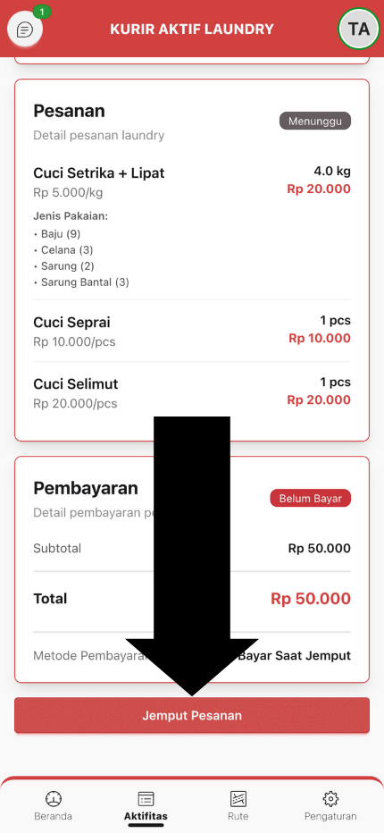
</p>

#### Langkah 1: Cari Pesanan yang Siap Dijemput

1. Buka menu **"Aktifitas"** dari bottom navigation
2. Cari pesanan dengan status **"Menunggu"** (badge abu-abu)
3. Atau cek di **"Beranda"** bagian "Aktifitas Terbaru"
4. Klik card pesanan untuk melihat detail

#### Langkah 2: Cek Detail Pesanan

Pada halaman detail, perhatikan:

**Informasi Pelanggan:**
- Nama pelanggan
- Nomor HP (klik untuk WhatsApp)
- Alamat lengkap

**Informasi Pesanan:**
- Layanan yang dipesan
- Catatan khusus (jika ada)

#### Langkah 3: Hubungi Pelanggan (Opsional)

Sebelum mengambil pesanan, disarankan untuk:

1. Klik **nomor HP pelanggan**
2. Akan otomatis terbuka WhatsApp dengan template pesan:
   ```
   Halo [Nama Pelanggan], saya [Nama Kurir] dari Aktif Laundry.

   Saya kurir yang akan menjemput pakaian laundry Anda dengan
   kode transaksi [Kode Transaksi].

   Apakah alamat penjemputan sudah sesuai?
   [Alamat Pelanggan]

   Mohon konfirmasi jika ada perubahan alamat atau waktu penjemputan.
   Terima kasih!
   ```
3. Kirim pesan atau edit sesuai kebutuhan

#### Langkah 4: Ambil Pesanan

1. Klik tombol **"Jemput Pesanan"** di bagian bawah
2. Modal konfirmasi akan muncul
3. Baca pesan konfirmasi: *"Apakah Anda yakin ingin mengambil pesanan?"*
4. Klik **"Ya, Jemput"**
5. Status akan otomatis berubah menjadi **"Proses"**
6. Nama Anda akan tercatat sebagai **Kurir Jemput**

#### Langkah 5: Navigasi ke Lokasi Pelanggan (Let's Go! 🏍️)

Setelah klik "Ya, Jemput", bakal langsung dibawa ke halaman navigasi kece:

1. **Peta langsung kebuka otomatis** - Gak perlu klik apa-apa lagi
2. **Peta bakal nunjukin:**
   - **Lokasi kamu** (ikon motor/mobil yang keren) 🏍️
   - **Lokasi pelanggan** (ikon rumah) 🏠
   - **Garis biru** = Rute tercepat buat sampai kesana
3. **Gas pol!** Ikutin garis biru, sampe deh ke lokasi

> **Tips Penting:** Pastikan GPS HP kamu **NYALA** ya! Kalo mati, ya namanya juga nyasar sendiri 😅

---

### 🚗 Cara Antar Pesanan

Langkah-langkah detail untuk mengantarkan pesanan yang sudah selesai dikerjakan.

<p align="center">
  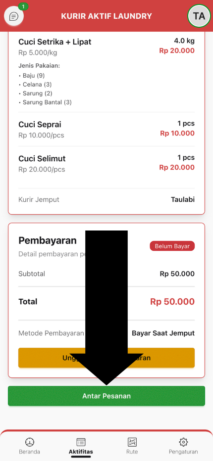
</p>

#### Langkah 1: Cari Pesanan yang Siap Diantar

1. Buka menu **"Aktifitas"**
2. Cari pesanan dengan status **"Selesai"** (badge hijau)
3. Atau cek di **"Beranda"** bagian "Pesanan Aktif"
4. Klik card pesanan untuk melihat detail

#### Langkah 2: Cek Detail Pesanan

Pada halaman detail, pastikan:

**Status Pesanan:**
- Badge menampilkan **"Selesai"** (warna hijau)
- Kolom "Kurir Antar" masih kosong atau belum ada

**Informasi Penting:**
- Total pembayaran
- Metode pembayaran (Tunai/Non-Tunai)
- Status pembayaran

#### Langkah 3: Hubungi Pelanggan

1. Klik **nomor HP pelanggan**
2. WhatsApp akan terbuka dengan template pesan:
   ```
   Halo [Nama Pelanggan], saya [Nama Kurir] dari Aktif Laundry.

   Saya kurir yang akan mengantarkan pakaian laundry Anda dengan
   kode transaksi [Kode Transaksi].

   Pakaian Anda sudah selesai dan siap diantar ke alamat:
   [Alamat Pelanggan]

   Mohon pastikan ada yang menerima di lokasi. Terima kasih!
   ```
3. Konfirmasi waktu pengantaran dengan pelanggan

#### Langkah 4: Ambil Pesanan untuk Diantar

1. Klik tombol **"Antar Pesanan"** di bagian bawah
2. Modal konfirmasi akan muncul
3. Baca pesan: *"Apakah Anda yakin ingin mengambil pesanan untuk diantar?"*
4. Klik **"Ya, Antar"**
5. Nama Anda akan tercatat sebagai **Kurir Antar**

#### Langkah 5: Navigasi ke Lokasi Pelanggan

1. Setelah mengambil pesanan, Anda akan diarahkan ke **"Rute Detail"**
2. Ikuti navigasi peta untuk sampai ke lokasi pelanggan

#### Langkah 6: Serahkan Pesanan & Terima Pembayaran

Saat sampai di lokasi:

1. Serahkan pakaian yang sudah bersih kepada pelanggan
2. Pastikan pelanggan memeriksa pakaiannya
3. **Jika pembayaran Non-Tunai:**
   - Tunjukkan **QR Code QRIS** yang ada di detail pesanan
   - Minta pelanggan scan untuk pembayaran
   - Atau pelanggan bisa upload bukti transfer sendiri
4. **Jika pembayaran Tunai:**
   - Terima uang tunai sesuai total
   - Berikan struk/nota (jika ada)

> **Catatan:** Status pembayaran akan diupdate oleh admin setelah verifikasi.

---

### 💳 Cara Upload Bukti Pembayaran

Jika pelanggan membayar non-tunai saat pengantaran dan Anda perlu upload bukti pembayaran.

<p align="center">
  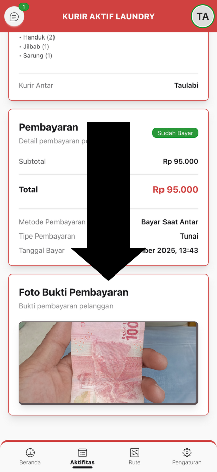
</p>

#### Langkah 1: Buka Detail Pesanan

1. Buka menu **"Aktifitas"**
2. Klik pesanan yang ingin diupload bukti pembayarannya
3. Pastikan status pembayaran masih **"Belum Bayar"**

#### Langkah 2: Klik Tombol Upload

1. Scroll ke bagian **"Pembayaran"**
2. Klik tombol **"Unggah Bukti Pembayaran"** (warna kuning)
3. Modal upload akan muncul

#### Langkah 3: Pilih Foto

1. Klik area **"Foto Bukti Pembayaran"**
2. Pilih foto dari galeri atau ambil foto baru
3. Anda bisa upload **lebih dari 1 foto**
4. **Format yang didukung:** JPG, PNG
5. **Ukuran maksimal:** 5 MB per file

#### Langkah 4: Preview & Hapus (Opsional)

Setelah memilih foto:
- Preview foto akan muncul di grid 2 kolom
- Klik tombol **X** di pojok kanan atas foto untuk menghapus
- Pilih foto lagi jika perlu tambah

#### Langkah 5: Upload

1. Setelah semua foto siap, klik tombol **"Unggah"**
2. Tunggu proses upload selesai
3. Status pembayaran akan berubah menjadi **"Menunggu Verifikasi"** (badge kuning)
4. Admin akan memverifikasi dan update status

> **Tips:** Pastikan foto jelas dan terlihat detail transaksinya (nama, nominal, tanggal).

---

### 🗺️ Cara Menggunakan Navigasi Rute (Fitur Paling Canggih!)

Panduan lengkap menggunakan fitur navigasi GPS real-time.

<p align="center">
  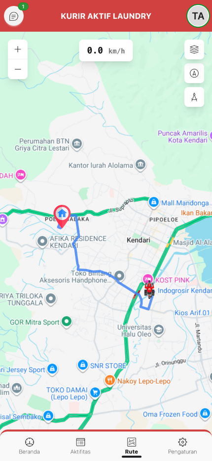
</p>

#### Persiapan Sebelum Navigasi (Checklist Penting!)

Sebelum gas pol, pastikan ini semua udah oke:

1. **GPS Nyala** ✅ - Cek di pengaturan HP, jangan sampe mati
2. **Internet Stabil** ✅ - Minimal 3G/4G biar peta gak lemot
3. **Izin Lokasi Udah Dikasih** ✅ - Pas pertama buka app biasanya minta izin, klik "Allow"
4. **Baterai Cukup** ✅ - Minimal 30%. GPS itu rakus baterai, kayak orang laper! 🔋

> **Jangan Lupa:** Bawa powerbank kalo perjalanan jauh. Baterai drop di tengah jalan = nightmare! 😱

#### Langkah 1: Buka Navigasi Rute

Ada 2 cara:

**Cara 1: Dari Detail Pesanan**
1. Setelah klik "Jemput Pesanan" atau "Antar Pesanan"
2. Otomatis diarahkan ke halaman Rute Detail

**Cara 2: Dari Menu Rute**
1. Buka menu **"Rute"** dari bottom navigation
2. Klik salah satu pesanan aktif
3. Halaman peta navigasi akan terbuka

#### Langkah 2: Memahami Tampilan Peta

<p align="center">
  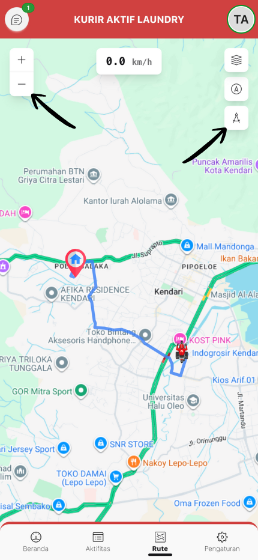
</p>

**Elemen Peta:**

1. **Marker Anda** (Ikon Motor/Mobil)
   - Ikon sesuai jenis kendaraan yang didaftarkan
   - Menunjukkan posisi real-time Anda
   - Berputar sesuai arah pergerakan (bearing)

2. **Marker Pelanggan** (Ikon Rumah)
   - Menunjukkan lokasi tujuan
   - Klik untuk lihat info pelanggan

3. **Garis Rute** (Warna Biru)
   - Jalur yang harus diikuti
   - Otomatis update jika Anda keluar jalur

**Kontrol Peta:**

**Kiri Atas - Zoom Controls:**
- **Tombol +** : Zoom in (perbesar)
- **Tombol -** : Zoom out (perkecil)

**Tengah Atas - Speed Indicator:**
- Menampilkan kecepatan Anda saat ini dalam **km/h**
- Update real-time setiap detik

**Kanan Atas - Map Controls:**
- **Layer** : Ganti tampilan peta
  - Street (Peta Jalan)
  - Satellite (Foto Satelit)
  - Traffic (Google Traffic - rekomendasi untuk navigasi)
- **Center** : Pusat peta ke lokasi Anda
- **Compass** : Orientasi peta mengikuti arah hadap Anda

#### Langkah 3: Mengikuti Navigasi

1. **Aktifkan GPS:**
   - GPS akan otomatis mencari sinyal
   - Status "Mencari..." akan muncul
   - Setelah fix, status berubah "Aktif" (hijau)

2. **Posisi Marker Anda:**
   - Marker Anda akan muncul di posisi GPS
   - Marker berputar sesuai arah pergerakan

3. **Garis Rute:**
   - Rute terbaik otomatis dihitung
   - Berwarna biru dari posisi Anda ke tujuan

4. **Ikuti Rute:**
   - Perhatikan garis rute di peta
   - Jika keluar jalur, rute akan recalculate otomatis
   - Lihat indikator kecepatan untuk kontrol kecepatan

#### Langkah 4: Menggunakan Fitur Lanjutan

**Ganti Layer Peta:**
1. Klik tombol **Layer** (kanan atas)
2. Pilih:
   - **Street** - Untuk lihat nama jalan
   - **Satellite** - Untuk lihat foto satelit
   - **Traffic** - Untuk lihat kondisi lalu lintas (rekomendasi)

**Zoom & Orientasi:**
- **Zoom in/out** - Gunakan tombol +/- atau pinch gesture
- **Pusat ke Lokasi** - Klik tombol Center jika peta bergeser
- **Aktifkan Compass** - Klik tombol Compass untuk rotasi peta sesuai arah hadap

**Klik Marker:**
- **Marker Anda** - Lihat koordinat, akurasi GPS, arah, dan kecepatan
- **Marker Pelanggan** - Lihat nama dan alamat

#### Tips Navigasi (Biar Makin Jago!)

**Supaya GPS Akurat Banget:**
- **Pake di tempat terbuka** - Gedung tinggi = musuh GPS. Jauhin!
- **Langit keliatan** - Indoor/basement = GPS ngambek. Keluar dulu bro!
- **Sabar dikit** - Tunggu 10-20 detik biar GPS "ngunci" satelit. Akurasi di bawah 10 meter = mantap! 🎯

**Hemat Baterai Pas Navigasi:**
- **Pake layer "Traffic"** - Jangan "Satellite", boros banget!
- **Kurangin brightness** - Mata enak, baterai hemat. Win-win! 🌙
- **Tutup app lain** - Fokus navigasi aja, TikTok belakangan 😄

**Kondisi Macet? Tenang Aja!**
- **Aktifin layer Traffic** - Bakal keliatan warna jalanan:
  - 🔴 **Merah** = Macet parah, siap-siap sabar
  - 🟡 **Kuning** = Macet dikit, santai
  - 🟢 **Hijau** = Lancar jaya, gas pol!
- **Cari jalan alternatif** - Swipe peta, cari jalan lain yang lebih ijo

> **Privacy Note:** GPS tracking **cuma jalan** pas halaman Rute Detail dibuka. Tutup halaman = tracking stop. Jadi gak disadap 24/7 ya, tenang aja! 🔒

---

### 💬 Cara Menggunakan Chat

Panduan berkomunikasi dengan Admin dan Pelanggan.

<p align="center">
  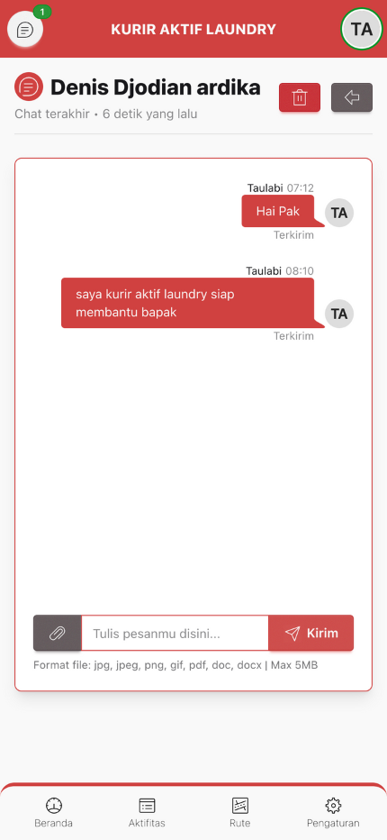
</p>

#### Membuka Chat

**Dari Notifikasi:**
- Klik badge notifikasi di **ikon chat** (top nav)
- Pilih percakapan

**Dari Menu Chat:**
1. Buka menu **"Chat"** dari top navigation
2. Cari atau klik percakapan yang ingin dibuka

#### Mengirim Pesan Text

1. Ketik pesan di kolom input bawah
2. Klik tombol **"Kirim"** atau tekan Enter
3. Pesan akan muncul di sisi kanan (bubble biru)
4. Status "Terkirim" atau "Dibaca" akan muncul di bawah bubble

#### Mengirim File/Foto

1. Klik ikon **Paperclip** (📎) di sebelah kiri kolom input
2. Pilih file dari galeri atau ambil foto baru
3. **Format yang didukung:**
   - Gambar: JPG, JPEG, PNG, GIF
   - Dokumen: PDF, DOC, DOCX
4. **Ukuran maksimal:** 5 MB
5. Modal preview akan muncul
6. (Opsional) Tulis pesan untuk file tersebut
7. Klik **"Kirim"**

#### Melihat File yang Dikirim

**Untuk Gambar:**
- Gambar akan tampil inline di bubble chat
- Klik gambar untuk lihat fullscreen
- Klik tombol Download untuk simpan

**Untuk Dokumen:**
- Nama file akan tampil dengan ikon paperclip
- Klik untuk download dan buka

#### Membuat Chat Baru

1. Klik tombol **"Buat Chat"** di halaman Chat
2. Pilih **Tipe Participant:**
   - Admin - Untuk chat dengan admin/kasir
   - Pelanggan - Untuk chat dengan pelanggan
3. Pilih **Nama Participant** dari dropdown
4. Klik **"Buat Chat"**
5. Chat room akan otomatis terbuka

#### Menghapus Percakapan

1. Buka chat room yang ingin dihapus
2. Klik tombol **"Hapus"** (merah) di header
3. Modal konfirmasi akan muncul
4. Klik **"Ya, Hapus"**
5. Percakapan dan semua file akan terhapus permanen

> **Perhatian:** File yang dihapus tidak bisa dikembalikan!

#### Fitur Otomatis

- **Auto-scroll:** Otomatis scroll ke pesan terbaru saat ada pesan baru
- **Auto-refresh:** Pesan baru otomatis muncul tanpa refresh manual
- **Mark as Read:** Pesan otomatis ter-mark "Dibaca" saat dibuka

---

### 👤 Cara Edit Profile & Set Lokasi

Panduan lengkap mengelola profil dan mengatur lokasi rumah Anda.

<p align="center">
  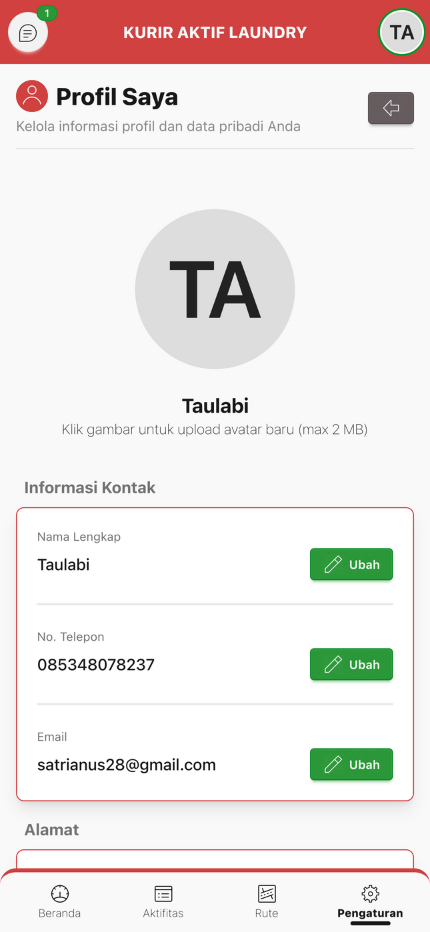
</p>

#### Upload Avatar

1. Buka menu **"Pengaturan"** > Klik **"Kelola Profil"**
2. Klik **gambar avatar** di bagian atas
3. Pilih foto dari galeri
4. **Format:** JPG, PNG
5. **Ukuran maksimal:** 2 MB
6. Avatar akan otomatis terupload dan ter-update

#### Edit Nama

1. Di halaman Profile, klik tombol **"Ubah"** di baris Nama
2. Modal akan muncul
3. Ketik nama lengkap baru
4. Klik **"Simpan"**

#### Edit Nomor HP

1. Klik tombol **"Ubah"** di baris No. Telepon
2. Masukkan nomor HP baru
3. **Format yang diterima:**
   - 08xxxxxxxxxx
   - 628xxxxxxxxxx
   - +628xxxxxxxxxx
4. Klik **"Simpan"**
5. Nomor akan otomatis di-format ke format +62

#### Edit Email

1. Klik tombol **"Ubah"** di baris Email
2. Masukkan email baru (opsional, boleh kosong)
3. Klik **"Simpan"**

> **Catatan:** Email harus unik dan belum digunakan kurir lain.

#### Edit Alamat dengan Peta Interaktif

<p align="center">
  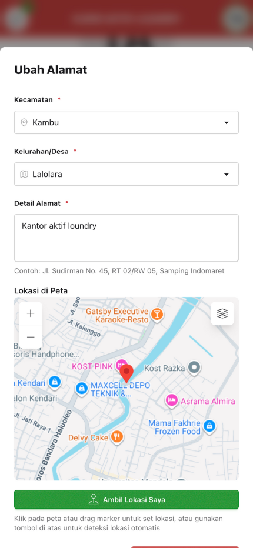
</p>

Fitur paling penting untuk memastikan lokasi Anda akurat!

**Langkah 1: Buka Modal Edit Alamat**
1. Di halaman Profile, scroll ke bagian **"Alamat"**
2. Klik tombol **"Ubah Alamat"**
3. Modal akan muncul dengan form dan peta

**Langkah 2: Pilih Wilayah**
1. **Pilih Kecamatan** dari dropdown
   - Dropdown otomatis terisi dengan kecamatan di Kendari
2. **Pilih Kelurahan/Desa** dari dropdown
   - Pilihan kelurahan akan muncul sesuai kecamatan
3. **Isi Detail Alamat**
   - Contoh: "Jl. Sudirman No. 45, RT 02/RW 05, Samping Indomaret"
   - Minimal 10 karakter

**Langkah 3: Set Lokasi di Peta**

Ada 3 cara set lokasi:

**Cara 1: Klik Peta**
- Klik titik di peta yang sesuai dengan lokasi rumah Anda
- Marker akan muncul di posisi yang diklik
- Koordinat otomatis ter-update

**Cara 2: Drag Marker**
- Jika marker sudah ada, drag ke posisi yang tepat
- Koordinat akan update saat Anda lepas marker

**Cara 3: Gunakan GPS Otomatis**
- Klik tombol **"Ambil Lokasi Saya"** di bawah peta
- Perangkat akan mendeteksi lokasi GPS Anda
- Marker akan muncul di posisi GPS
- Peta otomatis center ke lokasi Anda

> **Rekomendasi:** Gunakan GPS otomatis saat Anda berada di rumah untuk akurasi terbaik!

**Langkah 4: Gunakan Kontrol Peta**

**Zoom:**
- Klik **+** untuk zoom in (perbesar)
- Klik **-** untuk zoom out (perkecil)
- Atau gunakan pinch gesture

**Layer:**
- **Street** - Untuk lihat nama jalan
- **Satellite** - Untuk lihat foto satelit (rekomendasi untuk cari rumah)

**Langkah 5: Simpan Alamat**

1. Pastikan semua field sudah terisi:
   - Kecamatan ✓
   - Kelurahan ✓
   - Detail alamat ✓
   - Marker sudah di peta ✓
2. Klik tombol **"Simpan"**
3. Alamat lengkap akan ter-generate otomatis
4. Modal akan tertutup

**Preview Alamat Lengkap:**

Setelah simpan, alamat akan ditampilkan dalam format:
```
[Detail Alamat], Kelurahan [Kelurahan], Kecamatan [Kecamatan],
Kota Kendari, Sulawesi Tenggara
```

> **Penting:** Lokasi yang akurat membantu admin dan pelanggan menghubungi Anda, serta memudahkan navigasi saat jemput/antar pesanan!

---

## Tips & Trik

### 🚀 Performa & Kecepatan (Biar Ngebut Kayak WiFi Tetangga)

**Install PWA = Loading Super Cepat:**
- Install aplikasi ke home screen. Dijamin loading-nya ngebut kayak kurir lagi dikejar deadline 🏃‍♂️💨
- Data otomatis di-cache, jadi bisa buka offline (tapi fitur real-time tetep butuh internet ya)

**Hemat Kuota Internet:**
- Pake WiFi kalo ada (gratisan di warung kopi juga oke kok ☕)
- Layer peta "Street" lebih hemat data dari "Satellite" (bedanya bisa 3x lipat loh!)
- Jangan buka video TikTok sambil pake navigasi. Fokus dulu, nonton belakangan 😂

**Hemat Baterai (Biar Gak Mati di Tengah Jalan):**
- Aktifkan **mode gelap**. Mata enak, baterai awet, kurir happy 🌙
- Tutup halaman "Rute Detail" kalo udah sampe. GPS-nya makan baterai soalnya
- Kurangin brightness layar. HP gak perlu terang kayak lampu disco kok 🔦
- Matiin Bluetooth kalo gak dipake (ini sering lupa, padahal lumayan nguras baterai)

> **Life Hack:** Selalu bawa powerbank. Karena baterai HP itu kayak saldo ATM, tiba-tiba aja habis 🔋😭

### 📍 GPS & Navigasi (Biar Gak Nyasar Kayak Cincin Hilang)

**Supaya GPS Akurat:**
- Pake di tempat terbuka. GPS itu suka langit, bukan atap gedung 🌤️
- Hindari area gedung tinggi. Sinyal GPS bakal mental-mental kayak lagi main pinball
- Sabar nungguin sampe akurasi di bawah 10 meter. Kalo masih 50 meter, bisa nyasar 500 meter jadinya!

**GPS Ngaco? Loncat-Loncat Kesana-Kesini?**
1. **Restart aplikasi** - Obat mujarab yang sering dilupain
2. Cek **pengaturan lokasi** di HP, set ke **"High Accuracy"** atau **"Device Only"**
3. Clear cache browser (kayak beresin lemari baju, kadang perlu dikosongkan)
4. Pastikan GPS di HP kamu nyala (jangan ketawa, sering lupa beneran! 😅)
5. Kalo masih error, coba ke tempat yang lebih terbuka

**Hemat Baterai Pas Navigasi:**
- Pake layer **"Traffic"**, jangan **"Satellite"**. Satellite itu boros kayak AC ga dimatiin
- Matiin Compass kalo lagi berhenti
- Screen bisa di-lock pas lagi ngikutin rute lurus panjang (tapi tetep sering-sering cek ya!)

> **Fun Fact:** GPS itu butuh kontak mata sama satelit. Jadi kalo di dalam gedung/basement, ya... wassalam dah 🛰️

### 💬 Komunikasi Efektif (Biar Gak Salah Paham)

**Pake Template WhatsApp:**
- Template otomatis udah disediain, tinggal klik nomor HP pelanggan langsung kebuka
- Edit dikit kalo perlu (tambahin estimasi waktu tiba biar pelanggan gak was-was)
- Sopan selalu menang! Sapa dengan ramah, pelanggan pasti seneng 😊

**Chat dengan Bijak:**
- Upload foto kondisi pakaian pas jemput (buat bukti kalo ada apa-apa)
- Konfirmasi dulu sebelum antar: **"Ada yang terima ga nih?"** (daripada batal ditengah jalan)
- Jangan bales chat sambil nyetir. **BAHAYA!** Pinggir dulu, bales, lanjut jalan

> **Pro Tip:** Ketik "OK" atau "Siap" aja kalo lagi sibuk. Singkat, padat, jelas! 👍

### 📸 Upload Foto (Biar Gak Di-Reject Admin)

**Foto yang Oke:**
- **Jelas** - Jangan blur kayak foto hantu 👻
- **Terang** - Lampu yang cukup. Jangan asal jedret di tempat gelap
- **Lengkap** - Detail transaksi keliatan semua (nama, nominal, tanggal)
- **Ukuran wajar** - Max 5 MB. Kalo lebih, compress dulu pake app (banyak kok yang gratis)

**Upload Gagal Terus?**
1. Cek sinyal internet. Kalo cuma 1 bar, ya susah upload dong
2. Foto kegedean? Compress dulu pake app TinyPNG atau sejenisnya
3. Format selain JPG/PNG gak bisa. HEIC iPhone kadang error, convert dulu
4. Refresh halaman trus upload lagi. Kadang servernya lagi sibuk

> **Jangan:** Upload foto yang gelap, blur, atau kepotong. Nanti disuruh upload ulang, capek sendiri kan? 😓

### 🔐 Keamanan (Jaga Data Kayak Jaga Hati... Eaaa~)

**Password itu Penting Bro:**
- **Jangan share** ke siapapun. Termasuk pacar, sahabat, atau kucing peliharaan
- Ganti password tiap 3-6 bulan sekali (set reminder di kalender!)
- Minimal 8 karakter, kombinasi huruf, angka, simbol (contoh: `Kurir2024!`)
- Jangan pake password yang gampang ditebak: tanggal lahir, nama anak, dll

> **Kisah Nyata:** Ada kurir yang password-nya "123456". Akunnya kena hack. Data pelanggan bocor. Dia kena sanksi. Sad ending 😢

**Auto-Logout:**
- Kalo 30 hari gak login, otomatis logout (biar aman kalo HP ilang)
- Centang **"Ingat Saya"** cuma di HP pribadi ya! Jangan di HP pinjem

**Jaga Privasi:**
- **JANGAN** screenshot data pelanggan buat pamer di sosmed (ini serius, bisa kena UU ITE!)
- Lokasi tracking cuma aktif pas buka halaman Rute. Tutup halaman = tracking stop
- Chat dengan pelanggan stay di app, jangan di-forward kemana-mana

> **Reminder:** Data pelanggan = amanah. Dijaga ya! 🔒

---

## FAQ (Pertanyaan yang Sering Ditanya)

### 🤔 Umum

**Q: Apakah aplikasi ini gratis?**
A: **100% GRATIS!** Gak ada biaya langganan, gak ada iklan pop-up, gak ada "beli diamond" segala. Pokoknya gratis merdeka! 🎉

**Q: Apakah bisa digunakan offline?**
A: Sebagian bisa (data yang udah di-cache). Tapi ya gitu deh, fitur-fitur penting kayak GPS, Chat, Update Pesanan tetep butuh internet. Jadi ya... kurang lebih setengah-setengah lah 🤷‍♂️

**Q: Bagaimana cara update aplikasi?**
A: Gak perlu ribet! Aplikasi otomatis update sendiri pas kamu buka. Kalo ada update gede, bakal muncul notifikasi suruh refresh. Klik aja, selesai. Ez! ✨

### 🔐 Login & Akun

**Q: Lupa password, tapi tidak terima email reset?**
A: Cek folder **Spam/Junk** dulu (99% nyasar kesana). Masih gak ada juga? Chat admin aja, minta direset manual. Gak usah malu, kita semua pernah kok! 😊

**Q: Kenapa tidak bisa login? Error terus!**
A: Coba cek ini dulu:
- Email sama password bener gak? (huruf besar/kecil ngaruh loh!)
- Internet nyala? Coba buka Google dulu, kalo bisa berarti internet OK
- Akun udah diaktifkan admin? Kalo baru daftar, tunggu konfirmasi dulu
- Masih error? Clear cache browser atau coba browser lain

**Q: Apakah harus verifikasi email? Ribet amat!**
A: Iya harus. Ini buat keamanan akun kamu sendiri loh! Daripada nanti di-hack terus data pelanggan bocor, kan repot. 1 menit doang kok, gampang! 👍

### 📦 Pesanan

**Q: Kenapa tombol "Jemput Pesanan" tidak muncul?**
A: Ada beberapa kemungkinan:
- Udah diambil kurir lain (siapa cepat dia dapat! 🏃‍♂️)
- Status pesanan bukan "Menunggu"
- Refresh halaman dulu, mungkin belum update

**Q: Bisa cancel pesanan yang sudah diambil gak?**
A: **Gak bisa** via aplikasi. Kalo ada kendala (macet parah, ban bocor, hujan deras, dll), langsung hubungi admin. Mereka bakal bantu kok!

**Q: Berapa lama data pesanan tersimpan?**
A: **SELAMANYA!** Semua pesanan disimpan permanent. Jadi kalo mau liat pesanan dari tahun kemarin juga bisa. Berguna buat evaluasi kinerja kamu loh!

### 🗺️ Navigasi & GPS

**Q: GPS tidak akurat / loncat-loncat kayak kursor lemot?**
A: Ah, klasik! GPS lagi galau nih. Coba solusi ini:
1. **Pindah ke tempat terbuka** - GPS butuh "lihat" langit, bukan atap gedung
2. **Restart aplikasi** - Kadang cuma perlu di-refresh doang
3. **Cek pengaturan GPS** - Set ke mode "High Accuracy" atau "Presisi Tinggi"
4. **Sabar dikit** - Tunggu 10-20 detik biar GPS "ngunci" satelit
5. **Masih ngaco?** - Mungkin HP-nya yang bermasalah. Coba restart HP

> **Real Talk:** GPS di gedung bertingkat atau basement itu kayak main petak umpet sama satelit. Susah! 🛰️

**Q: Rute tidak muncul di peta? Kosong melompong!**
A: Kemungkinan besar:
- **Internet lelet** - Peta butuh download data, kalo internetnya 1 bar ya... yaudah 📶
- **Koordinat pelanggan belum di-set** - Adminnya lupa input. Chat aja minta di-update
- **Bug sementara** - Refresh halaman atau restart aplikasi

**Q: Apakah GPS tracking terus jalan meski app-nya di-minimize?**
A: **Gak kok!** GPS cuma nyala pas kamu buka halaman "Rute Detail". Tutup halaman = tracking berhenti. Jadi aman, gak disadap terus 24/7 😄

### 💬 Chat

**Q: Pesan tidak terkirim? Stuck loading terus!**
A: Beberapa hal yang perlu dicek:
- **Internet mati?** - Ya iya lah gak bisa kirim 😅
- **File kegedean?** - Max 5 MB ya! Kalo lebih, compress dulu
- **Format file aneh?** - Cuma support JPG, PNG, GIF, PDF, DOC, DOCX
- **Server lagi maintenance?** - Jarang sih, tapi bisa aja. Tunggu 5-10 menit trus coba lagi

**Q: Apakah chat tersimpan? Bisa diliat lagi gak?**
A: **Bisa!** Semua chat tersimpan di server. Mau ngobrol dari bulan lalu juga masih ada. Kecuali kamu sendiri yang hapus percakapannya.

**Q: Bisa chat dengan sesama kurir gak? Buat koordinasi gitu**
A: **Gak bisa.** Chat cuma buat komunikasi sama Admin atau Pelanggan aja. Kalo mau chat sama kurir lain, pake WhatsApp grup kek atau apalah 😄

### 💰 Pembayaran

**Q: Upload bukti pembayaran untuk apa sih?**
A: Buat **mempercepat verifikasi** aja! Admin bakal cek foto bukti bayar kamu, terus update status pembayaran. Jadi pelanggan happy, admin happy, kamu juga happy! Win-win-win! 🎉

**Q: Apakah kurir yang terima uang dari pelanggan?**
A: **Tergantung kebijakan laundry** kamu:
- **Tunai:** Biasanya kurir yang terima, terus disetor ke admin/kasir
- **Non-Tunai:** Pelanggan transfer langsung ke rekening laundry via QRIS/transfer bank

Tanya admin kamu dulu biar jelas ya!

**Q: QR Code yang ada di detail pesanan itu buat apa?**
A: Itu **QR Code QRIS** buat pembayaran non-tunai. Pelanggan tinggal scan pake app mobile banking (GoPay, OVO, Dana, BCA Mobile, dll), langsung bayar. Praktis! 📱💳

### 👤 Profile & Pengaturan

**Q: Kenapa harus set lokasi rumah? Aman gak sih?**
A: **Aman kok!** Ini buat:
- Admin bisa liat kurir terdekat dari lokasi pelanggan (biar efisien)
- Navigasi jadi lebih akurat
- Koordinasi lebih gampang

Lokasi kamu cuma keliatan sama admin, gak dipublish ke publik. Santai aja! 😊

**Q: Upload avatar gagal terus! Kesel deh!**
A: Coba cek ini:
- **Format file** - Harus JPG atau PNG (bukan GIF, BMP, atau format aneh lainnya)
- **Ukuran** - Max 2 MB! Kalo lebih, compress dulu pake app (TinyPNG, Compressor.io, dll)
- **Koneksi internet** - Pastikan stabil, jangan 1 bar doang

> **Tips:** Foto avatar gak usah HD 4K segala. Yang penting keliatan muka, gak blur. Simple is the best! 📸

**Q: Mode gelap gak jalan? Udah di-toggle masih terang aja!**
A: Coba **refresh halaman** dulu (F5 atau swipe down). Masih gak jalan juga? **Clear cache** browser. Terakhir, **restart aplikasi**. Pasti jalan deh!

### 🔔 Notifikasi

**Q: Kok gak pernah dapet notif pesanan baru?**
A: Cek ini dulu bro:
- **Izin notifikasi** - Browser minta izin kan pas pertama buka? Pastikan kamu klik "Allow/Izinkan"
- **Aplikasi udah di-install** sebagai PWA? Kalo belum, install dulu
- **Setting HP** - Cek pengaturan notifikasi di HP, pastikan browser-nya gak di-block

**Q: Notifikasinya kebanyakan! Ganggu banget!**
A: Sayangnya belum ada setting buat atur notifikasi di app. Kalo ganggu banget, chat admin aja buat kasih feedback. Siapa tau nanti ada update! 💬

### 🛠️ Teknis (Troubleshooting)

**Q: Aplikasi lambat banget! Kayak lagi loading jaman dial-up!**
A: Wah, nostalgia jaman modem ya 😄 Coba ini:
1. **Clear cache browser** - Kayak bersihin sampah, perlu rutin
2. **Tutup tab browser lain** - RAM HP juga terbatas, kasian dia
3. **Restart aplikasi** - Kadang cuma butuh istirahat sebentar
4. **Reinstall PWA** - Uninstall dari home screen, install ulang
5. **Terakhir:** Cek HP kamu, storage penuh gak? RAM cukup gak?

**Q: Error terus saat upload foto! Frustasi deh!**
A: Coba langkah ini:
1. **Compress foto** - Pake app compressor (gratis banyak kok)
2. **Pake format JPG** - Format paling aman, jarang error
3. **Cek internet** - Jangan upload pas sinyal cuma 1 bar
4. **Upload satu-satu** - Jangan sekaligus banyak, biar gak nge-lag

**Q: Halaman blank / gak muat apa-apa! Putih doang!**
A: **Refresh halaman** (F5 atau swipe down). Masih blank? **Clear cache browser**. Masih juga? **Restart HP**. Kalo masih tetep blank, chat admin. Mungkin ada maintenance server 🔧

---

## Kontak & Dukungan

### 🆘 Butuh Bantuan? Jangan Malu Tanya!

Gak ada pertanyaan yang bodoh kok. Kita semua pernah jadi pemula. Jadi kalo ada yang bingung, langsung aja hubungi:

**📞 Hubungi Admin:**
- **Chat langsung di app** - Paling cepat! (menu Chat > Buat Chat > Pilih Admin)
- **WhatsApp:** [Nomor Admin] - Buat yang lebih suka WA
- **Email:** [Email Admin] - Buat pertanyaan detail/laporan

**⏰ Jam Operasional Support:**
- **Senin - Sabtu:** 08.00 - 20.00 WITA (siapin kopi dulu buat admin ya ☕)
- **Minggu:** 09.00 - 17.00 WITA (hari Minggu juga kerja, salut! 👏)

> **Pro Tip:** Kalo masalahnya urgent (pesanan penting, error fatal, dll), langsung telpon/WA aja. Jangan nunggu lama!

---

## Penutup

### 🎉 Selamat! Kamu Udah Jadi Kurir Pro!

Setelah baca dokumentasi ini sampe habis, kamu udah naik level dari **Kurir Biasa** jadi **Kurir Pro** yang:
- ✅ Gak pernah nyasar lagi (thanks to GPS!)
- ✅ Selalu update status pesanan real-time
- ✅ Komunikasi sama pelanggan lancar jaya
- ✅ Upload bukti pembayaran dengan cepat
- ✅ Paham semua fitur aplikasi

**Inget ya:**
- 🚀 Aplikasi ini dibuat buat **memudahkan** pekerjaan kamu, bukan bikin ribet
- 💪 Semakin sering dipake, semakin jago kamu
- 🤝 Kalo ada masalah, **jangan diem aja**. Langsung hubungi admin!
- 📱 Aplikasi ini terus diupdate biar makin bagus. Stay tuned!

---

### ❤️ Apresiasi

**Terima kasih sudah jadi bagian dari Team SiAktif!**

Tanpa kalian para kurir, baju kotor gak bakal sampai di tempat laundry, dan baju bersih gak bakal sampai ke pelanggan. Kalian itu **ujung tombak** bisnis laundry ini!

Jadi, **terus semangat** ya! 🔥

Tetap aman di jalan, jaga kesehatan, dan senyum selalu! 😊

---

*Dokumen ini dibuat dengan ☕ kopi, 💻 keyboard, dan ❤️ hati oleh Team SiAktif*

**Versi:** 1.0
**Terakhir diperbarui:** Januari 2026
**Status:** Siap Pakai & Tested 100% ✅

---

> **Quote Bijak:** *"Kurir yang hebat bukan yang paling cepat, tapi yang paling konsisten dan profesional"* - Admin SiAktif

**Happy Delivering! 🚚💨**
